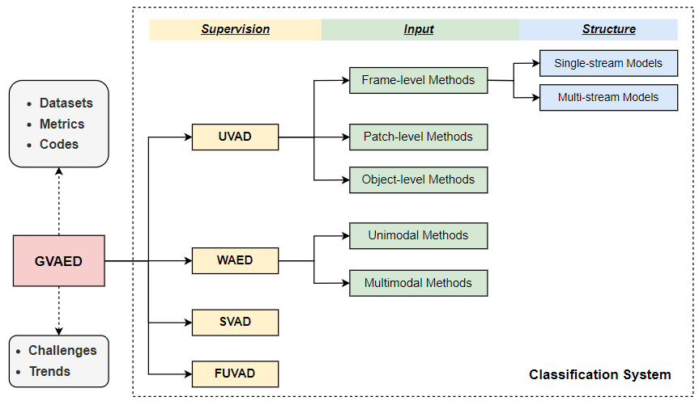

# Generalized Video Anomaly Event Detection: Systematic Taxonomy and Comparison of Deep Models

This is the official repository for our [paper](https://arxiv.org/abs/2302.05087) entitled *“Generalized Video Anomaly Event Detection: Systematic Taxonomy and Comparison of Deep Models”* submitted to [ACM Computing Surveys](https://dl.acm.org/journal/csur). We summarize existing deep learning-based video anomaly event detection (VAED) methods and classify these deep models  into four categories: unsupervised, weakly supervised, supervised, and fully unsupervised according to the supervised signal for training. In addition, we collate the public VAED datasets and available codes.

## Overview



## Datasets

| Dataset                                                                                                                                 | #Videos | #Normal | #Abnormal | #Scenes | #Anomalies |
| --------------------------------------------------------------------------------------------------------------------------------------- | ------- | ------- | --------- | ------- | ---------- |
| [UMN](http://mha.cs.umn.edu/proj_events.shtml#crowd)                                                                                    |         | 6,165   | 1,576     | 3       | 11         |
| [Subway Entrance](https://vision.eecs.yorku.ca/research/anomalous-behaviour-data/sets/)                                                 |         | 132,138 | 12,112    | 1       | 51         |
| [Subway Exit](https://vision.eecs.yorku.ca/research/anomalous-behaviour-data/sets/)                                                     |         | 60,410  | 4,491     | 1       | 14         |
| [Street Scene](https://www.merl.com/demos/video-anomaly-detection)$^{*}$                                                                | 81      | 159,341 | 43,916    | 205     | 17         |
| [CUHK Avenue](http://www.cse.cuhk.edu.hk/leojia/projects/detectabnormal/dataset.html)                                                   | 37      | 26,832  | 3,820     | 1       | 77         |
| [ShanghaiTech](https://svip-lab.github.io/dataset/campus_dataset.html)                                                                  | 437     | 300,308 | 17,090    | 13      | 158        |
| [UCSD Ped1](http://www.svcl.ucsd.edu/projects/anomaly/dataset.htm)                                                                      | 70      | 9,995   | 4,005     | 1       | 61         |
| [UCSD Ped2](http://www.svcl.ucsd.edu/projects/anomaly/dataset.htm)                                                                      | 29      | 2,924   | 1,636     | 1       | 21         |
| [UCF-Crime](https://webpages.charlotte.edu/cchen62/dataset.html)                                                                        | 1,900   |         |           |         | 950        |
| [ShanghaiTech Weakly](https://github.com/jx-zhong-for-academic-purpose/GCN-Anomaly-Detection/tree/master/ShanghaiTech_new_split)$^{**}$ | 437     |         |           |         |            |
| [XD-Violance](https://roc-ng.github.io/XD-Violence/)                                                                                    | 4,754   |         |           |         |            |
| [Ubnormal](https://github.com/lilygeorgescu/UBnormal)$^{***}$                                                                           | 543     | 147,887 | 89,015    | 29      | 660        |
| [ADOC](http://qil.uh.edu/main/datasets/)                                                                                                |         |         | 97,030    | 1       | 721        |

$^{*}$ *Following previous works, we set the frame rate to 15 fps.*

$^{***}$ *This dataset is reorganized from [ShanghaiTech](https://svip-lab.github.io/dataset/campus_dataset.html), so we provide the reorganized file list here.*

$^{***}$ *This datatset include a validation set that contains 64 videos.*

## Model Taxonomy

### 1. Unsupervised Video Anomaly Detection

#### 1.1 Frame-level methods

**2016 & Before**

- [LGA](https://ieeexplore.ieee.org/abstract/document/6247917):Video Anomaly Detection Based on Local Statistical Aggregates`CVPR`
  
  ```markdown
  Anomalies in many video surveillance applications have local spatio-temporal signatures, namely, they occur over a small time window or a small spatial region. The distinguishing feature of these scenarios is that outside this spatio-temporal anomalous region, activities appear normal. We develop a probabilistic framework to account for such local spatio-temporal anomalies. We show that our framework admits elegant characterization of optimal decision rules. A key insight of the paper is that if anomalies are local optimal decision rules are local even when the nominal behavior exhibits global spatial and temporal statistical dependencies. This insight helps collapse the large ambient data dimension for detecting local anomalies. Consequently, consistent data-driven local empirical rules with provable performance can be derived with limited training data. Our empirical rules are based on scores functions derived from local nearest neighbor distances. These rules aggregate statistics across spatio-temporal locations & scales, and produce a single composite score for video segments. We demonstrate the efficacy of our scheme on several video surveillance datasets and compare with existing work.
  ```

- [D-IncSFA](https://ietresearch.onlinelibrary.wiley.com/doi/full/10.1049/iet-cvi.2015.0271): Video anomaly detection using deepincremental slow feature analysis network`IET CV`
  
  ```markdown
  Existing anomaly detection (AD) approaches rely on various hand-crafted representations to represent video data and can be costly. The choice or designing of hand-crafted representation can be difficult when faced with a new dataset without prior knowledge. Motivated by feature learning, e.g. deep leaning and the ability to directly learn useful representations and model high-level abstraction from raw data, the authors investigate the possibility of using a universal approach. The objective is learning data-driven high-level representation for the task of video AD without relying on hand-crafted representation. A deep incremental slow feature analysis (D-IncSFA) network is constructed and applied to directly learning progressively abstract and global high-level representations from raw data sequence. The D-IncSFA network has the functionalities of both feature extractor and anomaly detector that make AD completion in one step. The proposed approach can precisely detect global anomaly such as crowd panic. To detect local anomaly, a set of anomaly maps, produced from the network at different scales, is used. The proposed approach is universal and convenient, working well in different types of scenarios with little human intervention and low memory and computational requirements. The advantages are validated by conducting extensive experiments on different challenge datasets.
  ```

- [VaAE](http://dm.snu.ac.kr/static/docs/TR/SNUDM-TR-2015-03.pdf):  Variational autoencoder based anomaly detection using reconstruction probability`Special Lecture on IE`
  
  ```markdown
  We propose an anomaly detection method using the reconstruction probability from the variational autoencoder. The reconstruction probability is a probabilistic measure that takes into account the variability of the distribution of variables. The reconstruction probability has a theoretical background making it a more principled and objective anomaly score than the reconstruction error, which is used by autoencoder and principal components based anomaly detection methods.
  ```

- [PC-LSTM](https://arxiv.org/abs/1612.00390): Anomaly Detection in Video Using Predictive Convolutional Long Short-Term Memory Networks`Arxiv`
  
  ```markdown
  Automating the detection of anomalous events within long video sequences is challenging due to the ambiguity of how such events are defined. We approach the problem by learning generative models that can identify anomalies in videos using limited supervision. We propose end-to-end trainable composite Convolutional Long Short-Term Memory (Conv-LSTM) networks that are able to predict the evolution of a video sequence from a small number of input frames. Regularity scores are derived from the reconstruction errors of a set of predictions with abnormal video sequences yielding lower regularity scores as they diverge further from the actual sequence over time. The models utilize a composite structure and examine the effects of conditioning in learning more meaningful representations. The best model is chosen based on the reconstruction and prediction accuracy. The Conv-LSTM models are evaluated both qualitatively and quantitatively, demonstrating competitive results on anomaly detection datasets. Conv-LSTM units are shown to be an effective tool for modeling and predicting video sequences.
  ```

- [AE](https://openaccess.thecvf.com/content_cvpr_2016/html/Hasan_Learning_Temporal_Regularity_CVPR_2016_paper.html): Learning Temporal Regularity in Video Sequences`CVPR`
  
  ```markdown
  Perceiving meaningful activities in a long video sequence is a challenging problem due to ambiguous definition of `meaningfulness' as well as clutters in the scene. We approach this problem by learning a generative model for regular motion patterns (termed as regularity) using multiple sources with very limited supervision. Specifically, we propose two methods that are built upon the autoencoders for their ability to work with little to no supervision. We first leverage the conventional handcrafted spatio-temporal local features and learn a fully connected autoencoder on them. Second, we build a fully convolutional feed-forward autoencoder to learn both the local features and the classifiers as an end-to-end learning framework. Our model can capture the regularities from multiple datasets. We evaluate our methods in both qualitative and quantitative ways - showing the learned regularity of videos in various aspects and demonstrating competitive performance on anomaly detection datasets as an application.
  ```

**2017**

- [Unmasking](https://openaccess.thecvf.com/content_iccv_2017/html/Ionescu_Unmasking_the_Abnormal_ICCV_2017_paper.html): Unmasking the abnormal events in video, `ICCV`
  
  ```markdown
  We propose a novel framework for abnormal event detection in video that requires no training sequences. Our framework is based on unmasking, a technique previously used for authorship verification in text documents, which we adapt to our task. We iteratively train a binary classifier to distinguish between two consecutive video sequences while removing at each step the most discriminant features. Higher training accuracy rates of the intermediately obtained classifiers represent abnormal events. To the best of our knowledge, this is the first work to apply unmasking for a computer vision task. We compare our method with several state-of-the-art supervised and unsupervised methods on four benchmark data sets. The empirical results indicate that our abnormal event detection framework can achieve state-of-the-art results, while running in real-time at 20 frames per second.
  ```

- [AdvAE](https://www.proquest.com/openview/d2f30b199a66bfac787cd24ca0905edc/1?pq-origsite=gscholar&cbl=18750): Adversarial Autoencoders for Anomalous Event Detection in Images

- [STAE](https://dl.acm.org/doi/abs/10.1145/3123266.3123451): Spatio-Temporal AutoEncoder for Video Anomaly Detection`ACM MM`
  
  ```markdown
  Anomalous events detection in real-world video scenes is a challenging problem due to the complexity of "anomaly" as well as the cluttered backgrounds, objects and motions in the scenes. Most existing methods use hand-crafted features in local spatial regions to identify anomalies. In this paper, we propose a novel model called Spatio-Temporal AutoEncoder (ST AutoEncoder or STAE), which utilizes deep neural networks to learn video representation automatically and extracts features from both spatial and temporal dimensions by performing 3-dimensional convolutions. In addition to the reconstruction loss used in existing typical autoencoders, we introduce a weight-decreasing prediction loss for generating future frames, which enhances the motion feature learning in videos. Since most anomaly detection datasets are restricted to appearance anomalies or unnatural motion anomalies, we collected a new challenging dataset comprising a set of real-world traffic surveillance videos. Several experiments are performed on both the public benchmarks and our traffic dataset, which show that our proposed method remarkably outperforms the state-of-the-art approaches.
  ```

- [AMDN](https://www.sciencedirect.com/science/article/pii/S1077314216301618): Detecting anomalous events in videos by learning deep representations of appearance and motion`CVIU`
  
  ```markdown
  Anomalous event detection is of utmost importance in intelligent video surveillance. Currently, most approaches for the automatic analysis of complex video scenes typically rely on hand-crafted appearance and motion features. However, adopting user defined representations is clearly suboptimal, as it is desirable to learn descriptors specific to the scene of interest. To cope with this need, in this paper we propose Appearance and Motion DeepNet (AMDN), a novel approach based on deep neural networks to automatically learn feature representations. To exploit the complementary information of both appearance and motion patterns, we introduce a novel double fusion framework, combining the benefits of traditional early fusion and late fusion strategies. Specifically, stacked denoising autoencoders are proposed to separately learn both appearance and motion features as well as a joint representation (early fusion). Then, based on the learned features, multiple one-class SVM models are used to predict the anomaly scores of each input. Finally, a novel late fusion strategy is proposed to combine the computed scores and detect abnormal events. The proposed ADMN is extensively evaluated on publicly available video surveillance datasets including UCSD pedestian, Subway, and Train, showing competitive performance with respect to state of the art approaches.
  ```

- [ConvLSTM-AE](https://ieeexplore.ieee.org/abstract/document/8019325): # Remembering history with convolutional LSTM for anomaly detection`ICME`
  
  ```markdown
  This paper tackles anomaly detection in videos, which is an extremely challenging task because anomaly is unbounded. We approach this task by leveraging a Convolutional Neural Network (CNN or ConvNet) for appearance encoding for each frame, and leveraging a Convolutional Long Short Term Memory (ConvLSTM) for memorizing all past frames which corresponds to the motion information. Then we integrate ConvNet and ConvLSTM with Auto-Encoder, which is referred to as ConvLSTM-AE, to learn the regularity of appearance and motion for the ordinary moments. Compared with 3D Convolutional Auto-Encoder based anomaly detection, our main contribution lies in that we propose a ConvLSTM-AE framework which better encodes the change of appearance and motion for normal events, respectively. To evaluate our method, we first conduct experiments on a synthesized Moving-MNIST dataset under controlled settings, and results show that our method can easily identify the change of appearance and motion. Extensive experiments on real anomaly datasets further validate the effectiveness of our method for anomaly detection.
  ```

- [DAF](https://link.springer.com/chapter/10.1007/978-3-319-68548-9_70): Deep Appearance Features for Abnormal Behavior Detection in Video`ICIAP`
  
  ```markdown
  We propose a novel framework for abnormal event detection in video that is based on deep features extracted with pre-trained convolutional neural networks (CNN). The CNN features are fed into a one-class Support Vector Machines (SVM) classifier in order to learn a model of normality from training data. We compare our approach with several state-of-the-art methods on two benchmark data sets, namely the Avenue data set and the UMN data set. The empirical results indicate that our abnormal event detection framework can reach state-of-the-art results, while running in real-time at 20 frames per second.
  ```

- [AA-STAE](https://www.hindawi.com/journals/am/2018/2087574/): Anomaly Detection in Moving Crowds through Spatiotemporal Autoencoding and Additional Attention`AM`
  
  ```markdown
  We propose an anomaly detection approach by learning a generative model using deep neural network. A weighted convolutional autoencoder- (AE-) long short-term memory (LSTM) network is proposed to reconstruct raw data and perform anomaly detection based on reconstruction errors to resolve the existing challenges of anomaly detection in complicated definitions and background influence. Convolutional AEs and LSTMs are used to encode spatial and temporal variations of input frames, respectively. A weighted Euclidean loss is proposed to enable the network to concentrate on moving foregrounds, thus restraining background influence. Moving foregrounds are segmented from the input frames using robust principal component analysis decomposition. Comparisons with state-of-the-art approaches indicate the superiority of our approach in anomaly detection. Generalization of anomaly detection is improved by enforcing the network to focus on moving foregrounds.
  ```

- [FFP](https://openaccess.thecvf.com/content_cvpr_2018/html/Liu_Future_Frame_Prediction_CVPR_2018_paper.html): Future Frame Prediction for Anomaly Detection – A New Baseline`CVPR`
  
  ```markdown
  Anomaly detection in videos refers to the identification of events that do not conform to expected behavior. However, almost all existing methods tackle the problem by minimizing the reconstruction errors of training data, which cannot guarantee a larger reconstruction error for an abnormal event. In this paper, we propose to tackle the anomaly detection problem within a video prediction framework. To the best of our knowledge, this is the first work that leverages the difference between a predicted future frame and its ground truth to detect an abnormal event. To predict a future frame with higher quality for normal events, other than the commonly used appearance (spatial) constraints on intensity and gradient, we also introduce a motion (temporal) constraint in video prediction by enforcing the optical flow between predicted frames and ground truth frames to be consistent, and this is the first work that introduces a temporal constraint into the video prediction task. Such spatial and motion constraints facilitate the future frame prediction for normal events, and consequently facilitate to identify those abnormal events that do not conform the expectation. Extensive experiments on both a toy dataset and some publicly available datasets validate the effectiveness of our method in terms of robustness to the uncertainty in normal events and the sensitivity to abnormal events.
  ```

**2019**

- [STU-net](https://ieeexplore.ieee.org/abstract/document/8907783): Spatio-Temporal Unity Networking for Video Anomaly Detection`IEEE Access`
  
  ```markdown
  Anomaly detection in video surveillance is challenging due to the variety of anomaly types and definitions, which limit the use of supervised techniques. As such, auto-encoder structures, a type of classical unsupervised method, have recently been utilized in this field. These structures consist of an encoder followed by a decoder and are typically adopted to restructure a current input frame or predict a future frame. However, regardless of whether a 2D or 3D autoencoder structure is adopted, only single-scale information from the previous layer is typically used in the decoding process. This can result in a loss of detail that could potentially be used to predict or reconstruct video frames. As such, this study proposes a novel spatio–temporal U-Net for frame prediction using normal events and abnormality detection using prediction error. This framework combines the benefits of U-Nets in representing spatial information with the capabilities of ConvLSTM for modeling temporal motion data. In addition, we propose a new regular score function, consisting of a prediction error for not only the current frame but also future frames, to further improve the accuracy of anomaly detection. Extensive experiments on common anomaly datasets, including UCSD (98 video clips in total) and CUHK Avenue (30 video clips in total), validated the performance of the proposed technique and we achieved 96.5% AUC for the Ped2 dataset, which is much better than existing autoencoder-based and U-Net-based methods.
  ```

- [GANs](https://ieeexplore.ieee.org/abstract/document/8658774): Training Adversarial Discriminators for Cross-Channel Abnormal Event Detection in Crowds`WACV`
  
  ```markdown
  Training Adversarial Discriminators for Cross-Channel Abnormal Event Detection in Crowds
  ```

- [AnomalyNet](https://ieeexplore.ieee.org/abstract/document/8649753): AnomalyNet: An Anomaly Detection Network for Video Surveillance`TIFS`
  
  ```markdown
  Sparse coding-based anomaly detection has shown promising performance, of which the keys are feature learning, sparse representation, and dictionary learning. In this paper, we propose a new neural network for anomaly detection (termed AnomalyNet) by deeply achieving feature learning, sparse representation, and dictionary learning in three joint neural processing blocks. Specifically, to learn better features, we design a motion fusion block accompanied by a feature transfer block to enjoy the advantages of eliminating noisy background, capturing motion, and alleviating data deficiency. Furthermore, to address some disadvantages (e.g., nonadaptive updating) of the existing sparse coding optimizers and embrace the merits of neural network (e.g., parallel computing), we design a novel recurrent neural network to learn sparse representation and dictionary by proposing an adaptive iterative hard-thresholding algorithm (adaptive ISTA) and reformulating the adaptive ISTA as a new long short-term memory (LSTM). To the best of our knowledge, this could be one of the first works to bridge theℓ1 -solver and LSTM and may provide novel insight into understanding LSTM and model-based optimization (or named differentiable programming), as well as sparse coding-based anomaly detection. Extensive experiments show the state-of-the-art performance of our method in the abnormal events detection task.
  ```

- [ISTL](https://ieeexplore.ieee.org/abstract/document/8820090): Spatiotemporal Anomaly Detection Using Deep Learning for Real-Time Video Surveillance`TII`
  
  ```markdown
  Rapid developments in urbanization and autonomous industrial environments have augmented and expedited the need for intelligent real-time video surveillance. Recent developments in artificial intelligence for anomaly detection in video surveillance only address some of the challenges, largely overlooking the evolving nature of anomalous behaviors over time. Tightly coupled dependence on a known normality training dataset and sparse evaluation based on reconstruction error are further limitations. In this article, we propose the incremental spatiotemporal learner (ISTL) to address challenges and limitations of anomaly detection and localization for real-time video surveillance. ISTL is an unsupervised deep-learning approach that utilizes active learning with fuzzy aggregation, to continuously update and distinguish between new anomalies and normality that evolve over time. ISTL is demonstrated and evaluated on accuracy, robustness, computational overhead as well as contextual indicators, using three benchmark datasets. Results of these experiments validate our contribution and confirm its suitability for real-time video surveillance.
  ```

- [AnoPCN](https://dl.acm.org/doi/abs/10.1145/3343031.3350899): AnoPCN: Video Anomaly Detection via Deep Predictive Coding Network`MM`
  
  ```markdown
  Video anomaly detection is a challenging problem due to the ambiguity and complexity of how anomalies are defined. Recent approaches for this task mainly utilize deep reconstruction methods and deep prediction ones, but their performances suffer when they cannot guarantee either higher reconstruction errors for abnormal events or lower prediction errors for normal events. Inspired by the predictive coding mechanism explaining how brains detect events violating regularities, we address the Anomaly detection problem with a novel deep Predictive Coding Network, termed as AnoPCN, which consists of a Predictive Coding Module (PCM) and an Error Refinement Module (ERM). Specifically, PCM is designed as a convolutional recurrent neural network with feedback connections carrying frame predictions and feedforward connections carrying prediction errors. By using motion information explicitly, PCM yields better prediction results. To further solve the problem of narrow regularity score gaps in deep reconstruction methods, we decompose reconstruction into prediction and refinement, introducing ERM to reconstruct current prediction error and refine the coarse prediction. AnoPCN unifies reconstruction and prediction methods in an end-to-end framework, and it achieves state-of-the-art performance with better prediction results and larger regularity score gaps on three benchmark datasets including ShanghaiTech Campus, CUHK Avenue, and UCSD Ped2.
  ```

- [AMC](https://openaccess.thecvf.com/content_ICCV_2019/html/Nguyen_Anomaly_Detection_in_Video_Sequence_With_Appearance-Motion_Correspondence_ICCV_2019_paper.html): Anomaly Detection in Video Sequence with Appearance-Motion Correspondence`ICCV`
  
  ```markdown
  Anomaly detection in surveillance videos is currently a challenge because of the diversity of possible events. We propose a deep convolutional neural network (CNN) that addresses this problem by learning a correspondence between common object appearances (e.g. pedestrian, background, tree, etc.) and their associated motions. Our model is designed as a combination of a reconstruction network and an image translation model that share the same encoder. The former sub-network determines the most significant structures that appear in video frames and the latter one attempts to associate motion templates to such structures. The training stage is performed using only videos of normal events and the model is then capable to estimate frame-level scores for an unknown input. The experiments on 6 benchmark datasets demonstrate the competitive performance of the proposed approach with respect to state-of-the-art methods.
  ```

- [memAE](https://openaccess.thecvf.com/content_ICCV_2019/html/Gong_Memorizing_Normality_to_Detect_Anomaly_Memory-Augmented_Deep_Autoencoder_for_Unsupervised_ICCV_2019_paper.html): Memorizing Normality to Detect Anomaly: Memory-Augmented Deep Autoencoder for Unsupervised Anomaly Detection, `ICCV`, [Code](https://github.com/donggong1/memae-anomaly-detection)
  
  ```markdown
  Deep autoencoder has been extensively used for anomaly detection. Training on the normal data, the autoencoder is expected to produce higher reconstruction error for the abnormal inputs than the normal ones, which is adopted as a criterion for identifying anomalies. However, this assumption does not always hold in practice. It has been observed that sometimes the autoencoder "generalizes" so well that it can also reconstruct anomalies well, leading to the miss detection of anomalies. To mitigate this drawback for autoencoder based anomaly detector, we propose to augment the autoencoder with a memory module and develop an improved autoencoder called memory-augmented autoencoder, i.e. MemAE. Given an input, MemAE firstly obtains the encoding from the encoder and then uses it as a query to retrieve the most relevant memory items for reconstruction. At the training stage, the memory contents are updated and are encouraged to represent the prototypical elements of the normal data. At the test stage, the learned memory will be fixed, and the reconstruction is obtained from a few selected memory records of the normal data. The reconstruction will thus tend to be close to a normal sample. Thus the reconstructed errors on anomalies will be strengthened for anomaly detection. MemAE is free of assumptions on the data type and thus general to be applied to different tasks. Experiments on various datasets prove the excellent generalization and high effectiveness of the proposed MemAE.
  ```

- [TSC](https://ieeexplore.ieee.org/abstract/document/8851288): Video Anomaly Detection with Sparse Coding Inspired Deep Neural Networks, `TPAMI`, [Code](https://github.com/StevenLiuWen/sRNN_TSC_Anomaly_Detection)
  
  ```markdown
  This paper presents an anomaly detection method that is based on a sparse coding inspired Deep Neural Networks (DNN). Specifically, in light of the success of sparse coding based anomaly detection, we propose a Temporally-coherent Sparse Coding (TSC), where a temporally-coherent term is used to preserve the similarity between two similar frames. The optimization of sparse coefficients in TSC with the Sequential Iterative Soft-Thresholding Algorithm (SIATA) is equivalent to a special stacked Recurrent Neural Networks (sRNN) architecture. Further, to reduce the computational cost in alternatively updating the dictionary and sparse coefficients in TSC optimization and to alleviate hyperparameters selection in TSC, we stack one more layer on top of the TSC-inspired sRNN to reconstruct the inputs, and arrive at an sRNN-AE. We further improve sRNN-AE in the following aspects: i) rather than using a predefined similarity measurement between two frames, we propose to learn a data-dependent similarity measurement between neighboring frames in sRNN-AE to make it more suitable for anomaly detection; ii) to reduce computational costs in the inference stage, we reduce the depth of the sRNN in sRNN-AE and, consequently, our framework achieves real-time anomaly detection; iii) to improve computational efficiency, we conduct temporal pooling over the appearance features of several consecutive frames for summarizing information temporally, then we feed appearance features and temporally summarized features into a separate sRNN-AE for more robust anomaly detection. To facilitate anomaly detection evaluation, we also build a large-scale anomaly detection dataset which is even larger than the summation of all existing datasets for anomaly detection in terms of both the volume of data and the diversity of scenes. Extensive experiments on both a toy dataset under controlled settings and real datasets demonstrate that our method significantly outperforms existing methods, which validates the effectiveness of our sRNN-AE method for anomaly detection. Codes and data have been released at https://github.com/StevenLiuWen/sRNN_TSC_Anomaly_Detection .
  ```

**2020**

- [residual-STAE](https://link.springer.com/article/10.1007/s11760-020-01740-1): Residual spatiotemporal autoencoder for unsupervised video anomaly detection`SIVP`
  
  ```markdown
  Modeling abnormal spatiotemporal events is challenging since data belonging to abnormal activities are less in the course of a surveillance stream. We solve this issue using a normality modeling approach, where abnormalities are detected as deviations from the normal patterns. To this end, we propose a residual spatiotemporal autoencoder, which is trainable end-to-end to carry out the anomaly detection task in surveillance videos. Irregularities are detected using the reconstruction loss, where normal frames are reconstructed well with a low reconstruction cost, and the converse is identified as abnormal frames. We evaluate the effect of residual connections in the STAE architecture and presented good practices to train an autoencoder for video anomaly detection using benchmark datasets, namely CUHK-Avenue, UCSD-Ped2, and Live Videos. Comparisons with the existing approaches prove that the effectiveness of residual blocks is incremental than going deeper with additional layers to train a spatiotemporal autoencoder with good generalization across datasets.
  ```

- [DD-GAN](https://ieeexplore.ieee.org/abstract/document/9090171): Dual Discriminator Generative Adversarial Network for Video Anomaly Detection`IEEE Access`
  
  ```markdown
  Video anomaly detection is an essential task because of its numerous applications in various areas. Because of the rarity of abnormal events and the complicated characteristic of videos, video anomaly detection is challenging and has been studied for a long time. In this paper, we propose a semi-supervised approach with a dual discriminator-based generative adversarial network structure. Our method considers more motion information in video clips compared with previous approaches. Specifically, in the training phase, we predict future frames for normal events via a generator and attempt to force the predicted frames to be similar to their ground truths. In addition, we utilize both a frame discriminator and motion discriminator to adverse the generator to generate more realistic and consecutive frames. The frame discriminator attempts to determine whether the input frames are generated or original frames sampled from the normal video. The motion discriminator attempts to determine whether the given optical flows are real or fake. Fake optical flows are estimated from generated frames and adjacent frames, and real optical flows are estimated from the real frames sampled from original videos. Then, in the testing phase, we evaluate the quality of predicted frames to obtain the regular score, and we consider those frames with lower prediction qualities as abnormal frames. The results of experiments on three publicly available datasets demonstrate the effectiveness of our proposed method.
  ```

- [Bi-Pre](https://www.sciencedirect.com/science/article/pii/S0262885620300470): Anomaly detection in surveillance video based on bidirectional prediction`IVC`
  
  ```markdown
  With the development of information technology and the popularization of monitoring network, how to quickly and automatically detect abnormal behaviors in surveillance video is becoming more and more important for public security and smart city. The emergence of deep learning has greatly promoted the development of anomaly detection and much remarkable work has been presented on this topic. However, the existing approaches for anomaly detection generally encounter problems such as insufficient utilization of motion patterns and instability on different datasets. To improve the performance of anomaly detection in surveillance video, we propose a framework based on bidirectional prediction, which predicts the same target frame by the forward and the backward prediction subnetworks, respectively. Then the loss function is constructed based on the real target frame and its bidirectional prediction frame. Furthermore, we also propose an anomaly score estimation method based on the sliding window scheme which focuses on the foregrounds of the prediction error map. The comparison with the state-of-the-art shows that the proposed model outperforms most competing models on different video surveillance datasets.
  ```

- [CDD-AE](https://link.springer.com/chapter/10.1007/978-3-030-58555-6_20): Clustering Driven Deep Autoencoder for Video Anomaly Detection`ECCV`
  
  ```markdown
  Because of the ambiguous definition of anomaly and the complexity of real data, video anomaly detection is one of the most challenging problems in intelligent video surveillance. Since the abnormal events are usually different from normal events in appearance and/or in motion behavior, we address this issue by designing a novel convolution autoencoder architecture to separately capture spatial and temporal informative representation. The spatial part reconstructs the last individual frame (LIF), while the temporal part takes consecutive frames as input and RGB difference as output to simulate the generation of optical flow. The abnormal events which are irregular in appearance or in motion behavior lead to a large reconstruction error. Besides, we design a deep k-means cluster to force the appearance and the motion encoder to extract common factors of variation within the dataset. Experiments on some publicly available datasets demonstrate the effectiveness of our method with the state-of-the-art performance.
  ```

- [MNAD](https://openaccess.thecvf.com/content_CVPR_2020/html/Park_Learning_Memory-Guided_Normality_for_Anomaly_Detection_CVPR_2020_paper.html): Learning Memory-Guided Normality for Anomaly Detection`CVPR`
  
  ```markdown
  We address the problem of anomaly detection, that is, detecting anomalous events in a video sequence. Anomaly detection methods based on convolutional neural networks (CNNs) typically leverage proxy tasks, such as reconstructing input video frames, to learn models describing normality without seeing anomalous samples at training time, and quantify the extent of abnormalities using the reconstruction error at test time. The main drawbacks of these approaches are that they do not consider the diversity of normal patterns explicitly, and the powerful representation capacity of CNNs allows to reconstruct abnormal video frames. To address this problem, we present an unsupervised learning approach to anomaly detection that considers the diversity of normal patterns explicitly, while lessening the representation capacity of CNNs. To this end, we propose to use a memory module with a new update scheme where items in the memory record prototypical patterns of normal data. We also present novel feature compactness and separateness losses to train the memory, boosting the discriminative power of both memory items and deeply learned features from normal data. Experimental results on standard benchmarks demonstrate the effectiveness and efficiency of our approach, which outperforms the state of the art.
  ```

- [OGNet](https://openaccess.thecvf.com/content_CVPR_2020/html/Zaheer_Old_Is_Gold_Redefining_the_Adversarially_Learned_One-Class_Classifier_Training_CVPR_2020_paper.html): Old Is $\mathcal{G}^{old}$: Redefining the Adversarially Learned One-Class Classifier Training Paradigm`CVPR`
  
  ```markdown
  A popular method for anomaly detection is to use the generator of an adversarial network to formulate anomaly score over reconstruction loss of input. Due to the rare occurrence of anomalies, optimizing such networks can be a cumbersome task. Another possible approach is to use both generator and discriminator for anomaly detection. However, attributed to the involvement of adversarial training, this model is often unstable in a way that the performance fluctuates drastically with each training step. In this study, we propose a framework that effectively generates stable results across a wide range of training steps and allows us to use both the generator and the discriminator of an adversarial model for efficient and robust anomaly detection. Our approach transforms the fundamental role of a discriminator from identifying real and fake data to distinguishing between good and bad quality reconstructions. To this end, we prepare training examples for the good quality reconstruction by employing the current generator, whereas poor quality examples are obtained by utilizing an old state of the same generator. This way, the discriminator learns to detect subtle distortions that often appear in reconstructions of the anomaly inputs. Extensive experiments performed on Caltech-256 and MNIST image datasets for novelty detection show superior results. Furthermore, on UCSD Ped2 video dataset for anomaly detection, our model achieves a frame-level AUC of 98.1%, surpassing recent state-of-the-art methods
  ```

**2021**

- [AMMC-net](https://ojs.aaai.org/index.php/AAAI/article/view/16177): Appearance-Motion Memory Consistency Network for Video Anomaly Detection`AAAI`
  
  ```markdown
  Abnormal event detection in the surveillance video is an essential but challenging task, and many methods have been proposed to deal with this problem. The previous methods either only consider the appearance information or directly integrate the results of appearance and motion information without considering their endogenous consistency semantics explicitly. Inspired by the rule humans identify the abnormal frames from multi-modality signals, we propose an Appearance-Motion Memory Consistency Network (AMMC-Net). Our method first makes full use of the prior knowledge of appearance and motion signals to explicitly capture the correspondence between them in the high-level feature space. Then, it combines the multi-view features to obtain a more essential and robust feature representation of regular events, which can significantly increase the gap between an abnormal and a regular event. In the anomaly detection phase, we further introduce a commit error in the latent space joint with the prediction error in pixel space to enhance the detection accuracy. Solid experimental results on various standard datasets validate the effectiveness of our approach.
  ```

- [AEP](https://ieeexplore.ieee.org/abstract/document/9346050): Abnormal Event Detection and Localization via Adversarial Event Prediction`TNNLS`
  
  ```markdown
  We present adversarial event prediction (AEP), a novel approach to detecting abnormal events through an event prediction setting. Given normal event samples, AEP derives the prediction model, which can discover the correlation between the present and future of events in the training step. In obtaining the prediction model, we propose adversarial learning for the past and future of events. The proposed adversarial learning enforces AEP to learn the representation for predicting future events and restricts the representation learning for the past of events. By exploiting the proposed adversarial learning, AEP can produce the discriminative model to detect an anomaly of events without complementary information, such as optical flow and explicit abnormal event samples in the training step. We demonstrate the efficiency of AEP for detecting anomalies of events using the UCSD-Ped, CUHK Avenue, Subway, and UCF-Crime data sets. Experiments include the performance analysis depending on hyperparameter settings and the comparison with existing state-of-the-art methods. The experimental results show that the proposed adversarial learning can assist in deriving a better model for normal events on AEP, and AEP trained by the proposed adversarial learning can surpass the existing state-of-the-art methods.
  ```

- [ROADMAP](https://ieeexplore.ieee.org/abstract/document/9446996): Robust Unsupervised Video Anomaly Detection by Multipath Frame Prediction, `TNNLS`
  
  ```markdown
  Video anomaly detection is commonly used in many applications, such as security surveillance, and is very challenging. A majority of recent video anomaly detection approaches utilize deep reconstruction models, but their performance is often suboptimal because of insufficient reconstruction error differences between normal and abnormal video frames in practice. Meanwhile, frame prediction-based anomaly detection methods have shown promising performance. In this article, we propose a novel and robust unsupervised video anomaly detection method by frame prediction with a proper design which is more in line with the characteristics of surveillance videos. The proposed method is equipped with a multipath ConvGRU-based frame prediction network that can better handle semantically informative objects and areas of different scales and capture spatial-temporal dependencies in normal videos. A noise tolerance loss is introduced during training to mitigate the interference caused by background noise. Extensive experiments have been conducted on the CUHK Avenue, ShanghaiTech Campus, and UCSD Pedestrian datasets, and the results show that our proposed method outperforms existing state-of-the-art approaches. Remarkably, our proposed method obtains the frame-level AUROC score of 88.3% on the CUHK Avenue dataset.
  ```

- [FFPN](https://ieeexplore.ieee.org/abstract/document/9622181): Future Frame Prediction Network for Video Anomaly Detection, `TPAMI`
  
  ```markdown
  Video Anomaly detection in videos refers to the identification of events that do not conform to expected behavior. However, almost all existing methods cast this problem as the minimization of reconstruction errors of training data including only normal events, which may lead to self-reconstruction and cannot guarantee a larger reconstruction error for an abnormal event. In this paper, we propose to formulate the video anomaly detection problem within a regime of video prediction. We advocate that not all video prediction networks are suitable for video anomaly detection. Then, we introduce two principles for the design of a video prediction network for video anomaly detection. Based on them, we elaborately design a video prediction network with appearance and motion constraints for video anomaly detection. Further, to promote the generalization of the prediction-based video anomaly detection for novel scenes, we carefully investigate the usage of a meta learning within our framework, where our model can be fast adapted to a new testing scene with only a few starting frames. Extensive experiments on both a toy dataset and three real datasets validate the effectiveness of our method in terms of robustness to the uncertainty in normal events and the sensitivity to abnormal events.
  ```

- [DSTAE](https://www.sciencedirect.com/science/article/pii/S092523122100179X): Two-stream deep spatial-temporal auto-encoder for surveillance video abnormal event detection, `Neurocomputing`
  
  ```
  With the improvement of public security awareness, video anomaly detection has become an indispensable demand in surveillance videos. To improve the accuracy of video anomaly detection, this paper proposes a novel two-stream spatial-temporal architecture called Two-Stream Deep Spatial-Temporal Auto-Encoder (Two-Stream DSTAE), which is composed of a spatial stream DSTAE and a temporal stream DSTAE. Firstly, the spatial stream extracts appearance characteristics whereas the temporal stream extracts the motion patterns, respectively. Then, based on the novel policy joint reconstruction error, this model fuses the spatial stream and the temporal stream to extract spatial-temporal characteristics to detect anomalies. Furthermore, since the optical flow is invariant to appearances such as color or light, we introduce optical flow to enhance the capability of extracting continuity between adjacent frames and inter-frame motion information. We demonstrate the accuracy of the proposed method on the publicly available standard datasets: UCSD, Avenue and UMN datasets. Our experiments demonstrate high accuracy, which is superior to the state-of-the-art methods.
  ```

**2022**

- [AMAE](https://ieeexplore.ieee.org/abstract/document/9739751): Appearance-Motion United Auto-Encoder Framework for Video Anomaly Detection`TCAS-II`
  
  ```markdown
  The key to video anomaly detection is understanding the appearance and motion differences between normal and abnormal events. However, previous works either considered the characteristics of appearance or motion in isolation or treated them without distinction, making the model fail to exploit the unique characteristics of both. In this brief, we propose an appearance-motion united auto-encoder (AMAE) framework to jointly learn the prototypical spatial and temporal patterns of normal events. The AMAE framework includes a spatial auto-encoder to learn appearance normality, a temporal auto-encoder to learn motion normality, and a channel attention-based spatial-temporal decoder to fuse the spatial-temporal features. The experimental results on standard benchmarks demonstrate the validity of the united appearance-motion normality learning. The proposed AMAE framework outperforms the state-of-the-art methods with AUCs of 97.4%, 88.2%, and 73.6% on the UCSD Ped2, CUHK Avenue, and ShanghaiTech datasets, respectively.
  ```

- [STM-AE](https://ieeexplore.ieee.org/abstract/document/9859727): Learning Appearance-Motion Normality for Video Anomaly Detection`ICME`
  
  ```markdown
  Video anomaly detection is a challenging task in the Computer vision community. Most single task-based methods do not consider the independence of unique spatial and temporal patterns, while two-stream structures lack the exploration of the correlations. In this paper, we propose spatial-temporal memories augmented two-stream auto-encoder framework, which learns the appearance normality and motion normal-ity independently and explores the correlations via adversar-ial learning. Specifically, we first design two proxy tasks to train the two-stream structure to extract appearance and motion features in isolation. Then, the prototypical features are recorded in the corresponding spatial and temporal memory pools. Finally, the encoding-decoding network performs ad-versariallearning with the discriminator to explore the corre-lations between spatial and temporal patterns. Experimental results show that our framework outperforms the state-of-the-art methods, achieving AUCs of 98.1% and 89.8% on UCSD Ped2 and CUHK Avenue datasets.
  ```

- [STC-Net](https://ieeexplore.ieee.org/abstract/document/9956287): Exploiting Spatial-temporal Correlations for Video Anomaly Detection`ICPR`
  
  ```markdown
  Video anomaly detection (VAD) remains a challenging task in the pattern recognition community due to the ambiguity and diversity of abnormal events. Existing deep learning-based VAD methods usually leverage proxy tasks to learn the normal patterns and discriminate the instances that deviate from such patterns as abnormal. However, most of them do not take full advantage of spatial-temporal correlations among video frames, which is critical for understanding normal patterns. In this paper, we address unsupervised VAD by learning the evolution regularity of appearance and motion in the long and short-term and exploit the spatial-temporal correlations among consecutive frames in normal videos more adequately. Specifically, we proposed to utilize the spatiotemporal long short-term memory (ST-LSTM) to extract and memorize spatial appearances and temporal variations in a unified memory cell. In addition, inspired by the generative adversarial network, we introduce a discriminator to perform adversarial learning with the ST-LSTM to enhance the learning capability. Experimental results on standard benchmarks demonstrate the effectiveness of spatial-temporal correlations for unsupervised VAD. Our method achieves competitive performance compared to the state-of-the-art methods with AUCs of 96.7%, 87.8%, and 73.1% on the UCSD Ped2, CUHK Avenue, and ShanghaiTech, respectively.
  ```

**2023**

- [AMP-Net](https://ieeexplore.ieee.org/abstract/document/10203018?casa_token=XdqJjIK2HSUAAAAA:Xu6MBGETgDWDwntp8VHo8ryHVUWICEXOrq-2eY8kqjqyNJfQv3coCuu_kZVsk0H1k3ygECRt9g): AMP-Net: Appearance-Motion Prototype Network Assisted Automatic Video Anomaly Detection System`IEEE TII`

  ```markdown
  As essential tools for industry safety protection, automatic video anomaly detection systems (AVADS) are designed to detect anomalous events of concern in surveillance videos. Existing VAD methods lack effective exploration of the prototypical appearance and motion features leading to poor performance in realistic scenarios. Specifically, they either misreport regular events as anomalies due to insufficient representation power, or lead to missed detections with over-power generalization. In this regard, we propose an appearance-motion prototype network (AMP-net) that uses external memories to record prototype features and augments the appearance-motion prototype with a spatial-temporal fusion. In addition, AMP-net sequentially fuses appearance features from deep to shallow to utilize multiscale spatial context. Additionally, we introduce temporal attention to capture important dynamics and enhance AMP-net for representing regular motion. The proposed method achieves a delicate balance of effective representation of normal events and limited generalization to anomalies. Experiments on three benchmark datasets demonstrate that our method can accurately detect anomalous events, achieving performance comparable to state-of-the-art methods with frame-level AUCs of 98.7%, 92.4%, and 78.8% on the UCSD Ped2, CUHK Avenue, and ShanghaiTech datasets. Moreover, we conducted a case study on the self-collected industrial dataset, and the results indicate that our AMP-net can cope with complex industrial scenarios and outperform existing methods.
  ```

- [MAAM-Net](https://www.sciencedirect.com/science/article/pii/S0031320323000365): Memory-augmented appearance-motion network for video anomaly detection, `Pattern Recognition`, [Code](https://github.com/Owen-Tian/MAAM-Net)

  ```markdown
  Video anomaly detection is a promising yet challenging task, where only normal events are observed in the training phase. Without any explicit classification boundary between normal and abnormal events, anomaly detection can be turned into an outlier detection problem by regarding any event that does not conform to the normal patterns as an anomaly. Most of the existing works mainly focus on improving the representation of normal events, while ignore the relationship between normal and abnormal events. Besides, the lack of restrictions on classification boundaries also leads to performance degradation. To address the above problems, we design a novel autoencoder-based Memory-Augmented Appearance-Motion Network (MAAM-Net), which consists of a novel end-to-end network to learn appearance and motion feature of a given input frame, a fused memory module to build a bridge for normal and abnormal events, a well-designed margin-based latent loss to relieve the computation costs, and a pointed Patch-based Stride Convolutional Detection (PSCD) algorithm to eliminate the degradation phenomenon. Specifically, the memory module is embedded between the encoder and decoder, which serves as a sparse dictionary of normal patterns, therefore it can be further employed to reintegrate abnormal events during inference. To further distort the reintegration quality of abnormal events, the margin-based latent loss is leveraged to enforce the memory module to select a sparse set of critical memory items. Last but not least, the simple yet effective detection method focuses on patches rather than the overall frame responses, which can benefit from the distortion of abnormal events. Extensive experiments and ablation studies on three anomaly detection benchmarks, i.e., UCSD Ped2, CUHK Avenue, and ShanghaiTech, demonstrate the effectiveness and efficiency of our proposed MAAM-Net. Notably, we achieve superior AUC performances on UCSD Ped2 (0.977), CHUK Avenue (0.909), and ShanghaiTech (0.713). The code is publicly available at https://github.com/Owen-Tian/MAAM-Net.
  ```

- [DSS-Net](https://ieeexplore.ieee.org/abstract/document/10174739?casa_token=98rr5rs3l7wAAAAA:goJpGT0-1gSRElf3QXeQsaFNi7WzZLjAabyfWUNk1m6tQey069Xvioi6liXX2Jj4XsmLa1XR6g): DSS-Net: Dynamic Self-Supervised Network for Video Anomaly Detection, `TMM`

  ```markdown
  Video Anomaly detection, aiming to detect the abnormal behaviors in surveillance videos, is a challenging task since the anomalous events are diversified and complicated in different situations. And this makes it difficult to use one single static network architecture to extract useful information from diverse abnormal patterns. Therefore, in this paper, we propose a novel Dynamic Self-Supervised Network (DSS-Net) to explore both spatial and temporal anomalous information. In our DSS-Net, we design a dynamic network to adaptively select suitable network architecture to extract latent features from different anomalous patterns and normal patterns. Specifically, we generate spatial and temporal pseudo-abnormal data as the input of the dynamic network to conduct self-supervised learning. And we have a specific design on Hybrid Anomaly Dynamic Convolution (HAD-Conv) to extract features for diversified anomalous events adaptively. We utilize both normal and pseudo-abnormal data to encourage the dynamic network to mine the discriminative information. Furthermore, we design a feature separation loss to maximize the difference between the anomalous and normal videos. We evaluate our proposed method on four public anomaly detection datasets and achieve competitive results compared with the state-of-the-art approaches.
  ```

- [TEVAD](https://openaccess.thecvf.com/content/CVPR2023W/O-DRUM/html/Chen_TEVAD_Improved_Video_Anomaly_Detection_With_Captions_CVPRW_2023_paper.html): TEVAD: Improved Video Anomaly Detection With Captions, `CVPR`, [Code](https://github.com/coranholmes/TEVAD)

  ```markdown
  Video surveillance systems are used to enhance the public safety and private assets. Automatic anomaly detection is vital in such surveillance systems to reduce the human labor and its associated costs. Previous works only consider spatial-temporal features. In many complex real-world scenarios, such visual features are unable to capture the semantic meanings required to further improve accuracy. To deal with such issues, we propose a novel framework: Text Empowered Video Anomaly Detection (TEVAD) which utilizes both visual and text features. Text features complements the visual features as they are semantically rich. Specifically, we compute text features based on the captions of the videos to capture the semantic meanings of abnormal events and thus improve the overall performance of video anomaly detection. Extensive experiments demonstrate that our proposed framework achieves state-of-the-art results on four benchmark datasets (i.e. ShanghaiTech, UCF-Crime, XD-Violence, and UCSD-Pedestrians) and achieves improved robustness. We further analyze the captions to provide additional explainability for the anomalous videos identified by our proposed algorithm. Our codes are available at https://github.com/coranholmes/TEVAD.
  ```

- [USTN-DSC](https://openaccess.thecvf.com/content/CVPR2023/html/Yang_Video_Event_Restoration_Based_on_Keyframes_for_Video_Anomaly_Detection_CVPR_2023_paper.html): Video Event Restoration Based on Keyframes for Video Anomaly Detection, `CVPR`

  ```markdown
  Video anomaly detection (VAD) is a significant computer vision problem. Existing deep neural network (DNN) based VAD methods mostly follow the route of frame reconstruction or frame prediction. However, the lack of mining and learning of higher-level visual features and temporal context relationships in videos limits the further performance of these two approaches. Inspired by video codec theory, we introduce a brand-new VAD paradigm to break through these limitations: First, we propose a new task of video event restoration based on keyframes. Encouraging DNN to infer missing multiple frames based on video keyframes so as to restore a video event, which can more effectively motivate DNN to mine and learn potential higher-level visual features and comprehensive temporal context relationships in the video. To this end, we propose a novel U-shaped Swin Transformer Network with Dual Skip Connections (USTN-DSC) for video event restoration, where a cross-attention and a temporal upsampling residual skip connection are introduced to further assist in restoring complex static and dynamic motion object features in the video. In addition, we propose a simple and effective adjacent frame difference loss to constrain the motion consistency of the video sequence. Extensive experiments on benchmarks demonstrate that USTN-DSC outperforms most existing methods, validating the effectiveness of our method.
  ```

- [NWPU](https://openaccess.thecvf.com/content/CVPR2023/html/Cao_A_New_Comprehensive_Benchmark_for_Semi-Supervised_Video_Anomaly_Detection_and_CVPR_2023_paper.html): A New Comprehensive Benchmark for Semi-Supervised Video Anomaly Detection and Anticipation, `CVPR`, [Code](https://campusvad.github.io/)

  ```markdown
  Semi-supervised video anomaly detection (VAD) is a critical task in the intelligent surveillance system. However, an essential type of anomaly in VAD named scene-dependent anomaly has not received the attention of researchers. Moreover, there is no research investigating anomaly anticipation, a more significant task for preventing the occurrence of anomalous events. To this end, we propose a new comprehensive dataset, NWPU Campus, containing 43 scenes, 28 classes of abnormal events, and 16 hours of videos. At present, it is the largest semi-supervised VAD dataset with the largest number of scenes and classes of anomalies, the longest duration, and the only one considering the scene-dependent anomaly. Meanwhile, it is also the first dataset proposed for video anomaly anticipation. We further propose a novel model capable of detecting and anticipating anomalous events simultaneously. Compared with 7 outstanding VAD algorithms in recent years, our method can cope with scene-dependent anomaly detection and anomaly anticipation both well, achieving state-of-the-art performance on ShanghaiTech, CUHK Avenue, IITB Corridor and the newly proposed NWPU Campus datasets consistently. Our dataset and code is available at: https://campusvad.github.io.
  ```

- [BFI](https://openaccess.thecvf.com/content/WACV2023/html/Deng_Bi-Directional_Frame_Interpolation_for_Unsupervised_Video_Anomaly_Detection_WACV_2023_paper.html): Bi-Directional Frame Interpolation for Unsupervised Video Anomaly Detection, `WACV`

  ```markdown
  Anomaly detection in video surveillance aims to detect anomalous frames whose properties significantly differ from normal patterns. Anomalies in videos can occur in both spatial appearance and temporal motion, making unsupervised video anomaly detection challenging. To tackle this problem, we investigate forward and backward motion continuity between adjacent frames and propose a new video anomaly detection paradigm based on bi-directional frame interpolation. The proposed framework consists of an optical flow estimation network and an interpolation network jointly optimized end-to-end to synthesize a middle frame from its nearest two frames. We further introduce a novel dynamic memory mechanism to balance memory sparsity and normality representation diversity, which attenuates abnormal features in frame interpolation without affecting normal prototypes. In inference, interpolation error and dynamic memory error are fused as anomaly scores. The proposed bi-directional interpolation design improves normal frame synthesis, lowering the false alarm rate of anomaly appearance; meanwhile, the implicit "regular" motion constraint in our optical flow estimation and the novel dynamic memory mechanism play blocking roles in interpolating abnormal frames, increasing the system's sensitivity to anomalies. Extensive experiments on public benchmarks demonstrate the superiority of the proposed framework over prior arts.
  ```

- [MSN-net](https://ieeexplore.ieee.org/abstract/document/10097052?casa_token=7SOKHcBWR5gAAAAA:YGoC4ZzTBX30EObdUzjCgWfhbqhodBxHTWNhw7w3d3zcJB0lArnSk4GNi4L1d-44ZoHAAhsITw): MSN-net: Multi-Scale Normality Network for Video Anomaly Detection, `ICASSP`

  ```markdown
  Existing unsupervised video anomaly detection methods often suffer from performance degradation due to the overgeneralization of deep models. In this paper, we propose a simple yet effective Multi-Scale Normality network (MSN-net) that uses hierarchical memories to learn multi-level prototypical spatial-temporal patterns of normal events. Specifically, the hierarchical memory module interacts with the encoder through the reading and writing operations during the training phase, preserving multi-scale normality in three separate memory pools. Then, the decoder decodes the features rewritten by the memorized normality to predict future frames so that its ability to predict anomalies is diminished. Experimental results show that MSN-net performs comparably to the state-of-the-art methods, and extension analysis demonstrates the effectiveness of multi-scale normality learning.
  ```

- [STGCN](https://ieeexplore.ieee.org/abstract/document/10095170?casa_token=yc0_qUyOMHcAAAAA:Cakpb9jWx54nQxHYitjxklk4LT_D00ud-qZlDyo-BHzTEI7FM3g7-8Gj1cMy4b4DsKhjM964ZQ): Spatial-Temporal Graph Convolutional Network Boosted Flow-Frame Prediction For Video Anomaly Detection, `ICASSP`

  ```markdown
  Video Anomaly Detection (VAD) is a critical technology for intelligent surveillance systems and remains a challenging task in the signal processing community. An intuitive idea for VAD is to use a two-stream network to learn appearance and motion normality, respectively. However, existing approaches usually design a network architecture for the appearance stream with effort, then apply a similar architecture to the motion stream, ignoring the unique appearance and motion characteristics. In this paper, we propose STGCN-FFP, an unsupervised Spatial-Temporal Graph Convolutional Networks (STGCN) boosted Flow-Frame Prediction model. Specifically, we first design an STGCN-based memory module to extract and memorize normal patterns for optical flow, which is more suitable for learning motion normality. Then, we use a memory-augmented auto-encoder to model normal appearance patterns. Finally, the latent representation of two streams is fused to predict future frames, boosting the model to learn spatial-temporal normality. To our knowledge, STGCN-FFP is the first work applying STGCN to uniquely model the motion normality. Our method performs comparably to the state-of-the-art methods on three benchmarks.
  ```

- [CRC](https://arxiv.org/abs/2308.01537): Learning Causality-inspired Representation Consistency for Video Anomaly Detection, `MM`

  ```markdown
  Video anomaly detection is an essential yet challenging task in the multimedia community, with promising applications in smart cities and secure communities. Existing methods attempt to learn abstract representations of regular events with statistical dependence to model the endogenous normality, which discriminates anomalies by measuring the deviations to the learned distribution. However, conventional representation learning is only a crude description of video normality and lacks an exploration of its underlying causality. The learned statistical dependence is unreliable for diverse regular events in the real world and may cause high false alarms due to overgeneralization. Inspired by causal representation learning, we think that there exists a causal variable capable of adequately representing the general patterns of regular events in which anomalies will present significant variations. Therefore, we design a causality-inspired representation consistency (CRC) framework to implicitly learn the unobservable causal variables of normality directly from available normal videos and detect abnormal events with the learned representation consistency. Extensive experiments show that the causality-inspired normality is robust to regular events with label-independent shifts, and the proposed CRC framework can quickly and accurately detect various complicated anomalies from real-world surveillance videos.
  ```

- [GESTA](https://ieeexplore.ieee.org/abstract/document/10078904): Learning Graph Enhanced Spatial-Temporal Coherence for Video Anomaly Detection, `IEEE SPL`

  ```markdown
  Video Anomaly Detection (VAD) is a critical yet challenging task in the signal processing community. Since part abnormal events cannot be detected by analyzing spatial or temporal information alone, learning spatial-temporal coherence has been proven the key to effective VAD. To this end, we propose a Graph Enhanced Spatial-Temporal Attention (GESTA) to address unsupervised VAD by learning the spatial-temporal coherence of normal events. Firstly, we propose a Dynamic Graph Recurrent Neural Network (DGRNN) to extract the motion patterns. Then, we propose a Spatial-Temporal Attention Module (STAM) to better model spatial-temporal coherence by integrating the prototypical spatial and temporal information. Finally, the fused spatial-temporal features are fed into the decoder to predict future frames. In testing phase, the anomaly with irregular information will result in poor prediction results. Experiments on three benchmarks demonstrate that our GESTA performs comparably to the state-of-the-art methods, and extensive analysis proves the effectiveness of DGRNN and STAM.
  ```

  

#### 1.2 Patch-level methods

**2016 & Before**

- [ADCS](https://ieeexplore.ieee.org/abstract/document/5539872): Anomaly Detection in Crowded Scenes, `CVPR`
  
  ```markdown
  A novel framework for anomaly detection in crowded scenes is presented. Three properties are identified as important for the design of a localized video representation suitable for anomaly detection in such scenes: (1) joint modeling of appearance and dynamics of the scene, and the abilities to detect (2) temporal, and (3) spatial abnormalities. The model for normal crowd behavior is based on mixtures of dynamic textures and outliers under this model are labeled as anomalies. Temporal anomalies are equated to events of low-probability, while spatial anomalies are handled using discriminant saliency. An experimental evaluation is conducted with a new dataset of crowded scenes, composed of 100 video sequences and five well defined abnormality categories. The proposed representation is shown to outperform various state of the art anomaly detection techniques.
  ```

- [STC](https://www.sciencedirect.com/science/article/pii/S1077314213001239): An on-line, real-time learning method for detecting anomalies in videos using spatio-temporal compositions, `CVIU`
  
  ```markdown
  This paper presents an approach for detecting suspicious events in videos by using only the video itself as the training samples for valid behaviors. These salient events are obtained in real-time by detecting anomalous spatio-temporal regions in a densely sampled video. The method codes a video as a compact set of spatio-temporal volumes, while considering the uncertainty in the codebook construction. The spatio-temporal compositions of video volumes are modeled using a probabilistic framework, which calculates their likelihood of being normal in the video. This approach can be considered as an extension of the Bag of Video words (BOV) approaches, which represent a video as an order-less distribution of video volumes. The proposed method imposes spatial and temporal constraints on the video volumes so that an inference mechanism can estimate the probability density functions of their arrangements. Anomalous events are assumed to be video arrangements with very low frequency of occurrence. The algorithm is very fast and does not employ background subtraction, motion estimation or tracking. It is also robust to spatial and temporal scale changes, as well as some deformations. Experiments were performed on four video datasets of abnormal activities in both crowded and non-crowded scenes and under difficult illumination conditions. The proposed method outperformed all other approaches based on BOV that do not account for contextual information.
  ```

- [STCNN](https://www.sciencedirect.com/science/article/pii/S0923596516300935): Spatial–temporal convolutional neural networks for anomaly detection and localization in crowded scenes, `SP:IC`
  
  ```markdown
  Abnormal behavior detection in crowded scenes is extremely challenging in the field of computer vision due to severe inter-object occlusions, varying crowd densities and the complex mechanics of a human crowd. We propose a method for detecting and locating anomalous activities in video sequences of crowded scenes. The key novelty of our method is the coupling of anomaly detection with a spatial–temporal Convolutional Neural Networks (CNN), which to the best of our knowledge has not been previously done. This architecture allows us to capture features from both spatial and temporal dimensions by performing spatial–temporal convolutions, thereby, both the appearance and motion information encoded in continuous frames are extracted. The spatial–temporal convolutions are only performed within spatial–temporal volumes of moving pixels to ensure robustness to local noise, and increase detection accuracy. We experimentally evaluate our model on benchmark datasets containing various situations with human crowds, and the results demonstrate that the proposed approach surpass state-of-the-art methods.
  ```

- [DeepAnomaly](https://www.mdpi.com/1424-8220/16/11/1904): DeepAnomaly: Combining Background Subtraction and Deep Learning for Detecting Obstacles and Anomalies in an Agricultural Field, `Sensors`
  
  ```markdown
  Convolutional neural network (CNN)-based systems are increasingly used in autonomous vehicles for detecting obstacles. CNN-based object detection and per-pixel classification (semantic segmentation) algorithms are trained for detecting and classifying a predefined set of object types. These algorithms have difficulties in detecting distant and heavily occluded objects and are, by definition, not capable of detecting unknown object types or unusual scenarios. The visual characteristics of an agriculture field is homogeneous, and obstacles, like people, animals and other obstacles, occur rarely and are of distinct appearance compared to the field. This paper introduces DeepAnomaly, an algorithm combining deep learning and anomaly detection to exploit the homogenous characteristics of a field to perform anomaly detection. We demonstrate DeepAnomaly as a fast state-of-the-art detector for obstacles that are distant, heavily occluded and unknown. DeepAnomaly is compared to state-of-the-art obstacle detectors including “Faster R-CNN: Towards Real-Time Object Detection with Region Proposal Networks” (RCNN). In a human detector test case, we demonstrate that DeepAnomaly detects humans at longer ranges (45–90 m) than RCNN. RCNN has a similar performance at a short range (0–30 m). However, DeepAnomaly has much fewer model parameters and (182 ms/25 ms =) a 7.28-times faster processing time per image. Unlike most CNN-based methods, the high accuracy, the low computation time and the low memory footprint make it suitable for a real-time system running on a embedded GPU (Graphics Processing Unit).
  ```

- [Deep-Cascade](https://ieeexplore.ieee.org/abstract/document/7858798): Deep-Cascade: Cascading 3D Deep Neural Networks for Fast Anomaly Detection and Localization in Crowded Scenes, `TIP`
  
  ```markdown
  This paper proposes a fast and reliable method for anomaly detection and localization in video data showing crowded scenes. Time-efficient anomaly localization is an ongoing challenge and subject of this paper. We propose a cubic-patch-based method, characterised by a cascade of classifiers, which makes use of an advanced feature-learning approach. Our cascade of classifiers has two main stages. First, a light but deep 3D auto-encoder is used for early identification of “many” normal cubic patches. This deep network operates on small cubic patches as being the first stage, before carefully resizing the remaining candidates of interest, and evaluating those at the second stage using a more complex and deeper 3D convolutional neural network (CNN). We divide the deep auto-encoder and the CNN into multiple sub-stages, which operate as cascaded classifiers. Shallow layers of the cascaded deep networks (designed as Gaussian classifiers, acting as weak single-class classifiers) detect “simple” normal patches, such as background patches and more complex normal patches, are detected at deeper layers. It is shown that the proposed novel technique (a cascade of two cascaded classifiers) performs comparable to current top-performing detection and localization methods on standard benchmarks, but outperforms those in general with respect to required computation time.
  ```

- [HOS](https://ieeexplore.ieee.org/abstract/document/7055905): Swarm Intelligence for Detecting Interesting Events in Crowded Environments, `TIP`
  
  ```markdown
  This paper focuses on detecting and localizing anomalous events in videos of crowded scenes, i.e., divergences from a dominant pattern. Both motion and appearance information are considered, so as to robustly distinguish different kinds of anomalies, for a wide range of scenarios. A newly introduced concept based on swarm theory, histograms of oriented swarms (HOS), is applied to capture the dynamics of crowded environments. HOS, together with the well-known histograms of oriented gradients, are combined to build a descriptor that effectively characterizes each scene. These appearance and motion features are only extracted within spatiotemporal volumes of moving pixels to ensure robustness to local noise, increase accuracy in the detection of local, nondominant anomalies, and achieve a lower computational cost. Experiments on benchmark data sets containing various situations with human crowds, as well as on traffic data, led to results that surpassed the current state of the art (SoA), confirming the method's efficacy and generality. Finally, the experiments show that our approach achieves significantly higher accuracy, especially for pixel-level event detection compared to SoA methods, at a low computational cost.
  ```

**2017**

- [sRNN](https://openaccess.thecvf.com/content_iccv_2017/html/Luo_A_Revisit_of_ICCV_2017_paper.html): A Revisit of Sparse Coding Based Anomaly Detection in Stacked RNN Framework, `ICCV`
  
  ```markdown
  Motivated by the capability of sparse coding based anomaly detection, we propose a Temporally-coherent Sparse Coding (TSC) where we enforce similar neighbouring frames be encoded with similar reconstruction coefficients. Then we map the TSC with a special type of stacked Recurrent Neural Network (sRNN). By taking advantage sRNN in learning all parameters simultaneously, the nontrivial hyper-parameter selection to TSC can be avoided, meanwhile with a shallow sRNN, the reconstruction coefficients can be inferred within a forward pass, which reduces the computational cost for learning sparse coefficients. The contributions of this paper are two-fold: i) We propose a TSC, which can be mapped to a sRNN which facilitates the parameter optimization and accelerates the anomaly prediction. ii) We build a very large dataset which is even larger than the summation of all existing dataset for anomaly detection in terms of both the volume of data and the diversity of scenes. Extensive experiments on both a toy dataset and real datasets demonstrate that our TSC based and sRNN based method consistently outperform existing methods, which validates the effectiveness of our method.
  ```

**2018**

**2019**

- [S$^2$-AVE](https://ieeexplore.ieee.org/abstract/document/8513816): Generative Neural Networks for Anomaly Detection in Crowded Scenes, `TIFS`, [Code](https://github.com/tianwangbuaa/)
  
  ```markdown
  Security surveillance is critical to social harmony and people's peaceful life. It has a great impact on strengthening social stability and life safeguarding. Detecting anomaly timely, effectively and efficiently in video surveillance remains challenging. This paper proposes a new approach, called $S^2-V A E$, for anomaly detection from video data. The $S^2$-VAE consists of two proposed neural networks: a Stacked Fully Connected Variational AutoEncoder $\left(S_F-V A E\right)$ and a Skip Convolutional VAE ( $S_C$-VAE). The $S_F-V A E$ is a shallow generative network to obtain a model like Gaussian mixture to fit the distribution of the actual data. The $S_{\mathrm{C}^{-}}$ $V A E$, as a key component of $S^2-V A E$, is a deep generative network to take advantages of CNN, VAE and skip connections. Both $S_F-V A E$ and $S_C$-VAE are efficient and effective generative networks and they can achieve better performance for detecting both local abnormal events and global abnormal events. The proposed $S^2$-VAE is evaluated using four public datasets. The experimental results show that the $S^2$-VAE outperforms the state-ofthe-art algorithms. The code is available publicly at https://github.com/tianwangbuaa/.
  ```

**2020**

- [DeepOC](https://ieeexplore.ieee.org/abstract/document/8825555): A Deep One-Class Neural Network for Anomalous Event Detection in Complex Scenes`TNNLS`
  
  ```markdown
  How to build a generic deep one-class (DeepOC) model to solve one-class classification problems for anomaly detection, such as anomalous event detection in complex scenes? The characteristics of existing one-class labels lead to a dilemma: it is hard to directly use a multiple classifier based on deep neural networks to solve one-class classification problems. Therefore, in this article, we propose a novel DeepOC neural network, termed as DeepOC, which can simultaneously learn compact feature representations and train a DeepOC classifier. Only with the given normal samples, we use the stacked convolutional encoder to generate their low-dimensional high-level features and train a one-class classifier to make these features as compact as possible. Meanwhile, for the sake of the correct mapping relation and the feature representations' diversity, we utilize a decoder in order to reconstruct raw samples from these low-dimensional feature representations. This structure is gradually established using an adversarial mechanism during the training stage. This mechanism is the key to our model. It organically combines two seemingly contradictory components and allows them to take advantage of each other, thus making the model robust and effective. Unlike methods that use handcrafted features or those that are separated into two stages (extracting features and training classifiers), DeepOC is a one-stage model using reliable features that are automatically extracted by neural networks. Experiments on various benchmark data sets show that DeepOC is feasible and achieves the state-of-the-art anomaly detection results compared with a dozen existing methods.
  ```

**2021**

- [ST-CaAE](https://ieeexplore.ieee.org/abstract/document/9055131): Spatial-Temporal Cascade Autoencoder for Video Anomaly Detection in Crowded Scenes, `TMM`
  
  ```markdown
  Time-efficient anomaly detection and localization in video surveillance still remains challenging due to the complexity of “anomaly”. In this paper, we propose a cuboid-patch-based method characterized by a cascade of classifiers called a spatial-temporal cascade autoencoder (ST-CaAE), which makes full use of both spatial and temporal cues from video data. The ST-CaAE has two main stages, defined by two proposed neural networks: a spatial-temporal adversarial autoencoder (ST-AAE) and a spatial-temporal convolutional autoencoder (ST-CAE). First, the ST-AAE is used to preliminarily identify anomalous video cuboids and exclude normal cuboids. The key idea underlying ST-AAE is to obtain a Gaussian model to fit the distribution of the regular data. Then in the second stage, the ST-CAE classifies the specific abnormal patches in each anomalous cuboid with reconstruction error based strategy that takes advantage of the CAE and skip connection. A two-stream framework is utilized to fuse the appearance and motion cues to achieve more complete detection results, taking the gradient and optical flow cuboids as inputs for each stream. The proposed ST-CaAE is evaluated using three public datasets. The experimental results verify that our framework outperforms other state-of-the-art works.
  ```

**2022**

- [AST-AE:](https://ieeexplore.ieee.org/abstract/document/9804454) Learning Attention Augmented Spatial-temporal Normality for Video Anomaly Detection, `ISHC`
  
  ```markdown
  Motivated by the capability of sparse coding based anomaly detection, we propose a Temporally-coherent Sparse Coding (TSC) where we enforce similar neighbouring frames be encoded with similar reconstruction coefficients. Then we map the TSC with a special type of stacked Recurrent Neural Network (sRNN). By taking advantage sRNN in learning all parameters simultaneously, the nontrivial hyper-parameter selection to TSC can be avoided, meanwhile with a shallow sRNN, the reconstruction coefficients can be inferred within a forward pass, which reduces the computational cost for learning sparse coefficients. The contributions of this paper are two-fold: i) We propose a TSC, which can be mapped to a sRNN which facilitates the parameter optimization and accelerates the anomaly prediction. ii) We build a very large dataset which is even larger than the summation of all existing dataset for anomaly detection in terms of both the volume of data and the diversity of scenes. Extensive experiments on both a toy dataset and real datasets demonstrate that our TSC based and sRNN based method consistently outperform existing methods, which validates the effectiveness of our method.
  ```

**2023**

- [PFMF](https://openaccess.thecvf.com/content/CVPR2023/html/Liu_Generating_Anomalies_for_Video_Anomaly_Detection_With_Prompt-Based_Feature_Mapping_CVPR_2023_paper.html): Generating Anomalies for Video Anomaly Detection With Prompt-Based Feature Mapping, `CVPR`

  ```markdown
  Anomaly detection in surveillance videos is a challenging computer vision task where only normal videos are available during training. Recent work released the first virtual anomaly detection dataset to assist real-world detection. However, an anomaly gap exists because the anomalies are bounded in the virtual dataset but unbounded in the real world, so it reduces the generalization ability of the virtual dataset. There also exists a scene gap between virtual and real scenarios, including scene-specific anomalies (events that are abnormal in one scene but normal in another) and scene-specific attributes, such as the viewpoint of the surveillance camera. In this paper, we aim to solve the problem of the anomaly gap and scene gap by proposing a prompt-based feature mapping framework (PFMF). The PFMF contains a mapping network guided by an anomaly prompt to generate unseen anomalies with unbounded types in the real scenario, and a mapping adaptation branch to narrow the scene gap by applying domain classifier and anomaly classifier. The proposed framework outperforms the state-of-the-art on three benchmark datasets. Extensive ablation experiments also show the effectiveness of our framework design.
  ```

  

#### 1.3 Object-level methods

**2017**

- [LDGK](https://openaccess.thecvf.com/content_iccv_2017/html/Hinami_Joint_Detection_and_ICCV_2017_paper.html):  Joint Detection and Recounting of Abnormal Events by Learning Deep Generic Knowledge, `ICCV`
  
  ```markdown
  This paper addresses the problem of joint detection and recounting of abnormal events in videos. Recounting of abnormal events, i.e., explaining why they are judged to be abnormal, is an unexplored but critical task in video surveillance, because it helps human observers quickly judge if they are false alarms or not. To describe the events in the human-understandable form for event recounting, learning generic knowledge about visual concepts (e.g., object and action) is crucial. Although convolutional neural networks (CNNs) have achieved promising results in learning such concepts, it remains an open question as to how to effectively use CNNs for abnormal event detection, mainly due to the environment-dependent nature of the anomaly detection. In this paper, we tackle this problem by integrating a generic CNN model and environment-dependent anomaly detectors. Our approach first learns CNN with multiple visual tasks to exploit semantic information that is useful for detecting and recounting abnormal events. By appropriately plugging the model into anomaly detectors, we can detect and recount abnormal events while taking advantage of the discriminative power of CNNs. Our approach outperforms the state-of-the-art on Avenue and UCSD Ped2 benchmarks for abnormal event detection and also produces promising results of abnormal event recounting.
  ```

**2018**

- [DCF](https://www.sciencedirect.com/science/article/pii/S0952197617302579): Deep convolutional framework for abnormal behavior detection in a smart surveillance system, `EAAI`
  
  ```markdown
  The ability to instantly detect risky behavior in video surveillance systems is a critical issue in a smart surveillance system. In this paper, a unified framework based on a deep convolutional framework is proposed to detect abnormal human behavior from a standard RGB image. The objective of the unified structure is to improve detection speed while maintaining recognition accuracy. The deep convolutional framework consists of (1) a human subject detection and discrimination module that is proposed to solve the problem of separating object entities, in contrast to previous object detection algorithms, (2) a posture classification module to extract spatial features of abnormal behavior, and (3) an abnormal behavior detection module based on long short-term memory (LSTM). Experiments on a benchmark dataset evaluate the potential of the proposed method in the context of smart surveillance. The results indicate that the proposed method provides satisfactory performance in detecting abnormal behavior in a real-world scenario.
  ```

**2019**

- [OC-AE](https://openaccess.thecvf.com/content_CVPR_2019/html/Ionescu_Object-Centric_Auto-Encoders_and_Dummy_Anomalies_for_Abnormal_Event_Detection_in_CVPR_2019_paper.html): Object-Centric Auto-Encoders and Dummy Anomalies for Abnormal Event Detection, `CVPR`
  
  ```markdown
  Abnormal event detection in video is a challenging vision problem. Most existing approaches formulate abnormal event detection as an outlier detection task, due to the scarcity of anomalous data during training. Because of the lack of prior information regarding abnormal events, these methods are not fully-equipped to differentiate between normal and abnormal events. In this work, we formalize abnormal event detection as a one-versus-rest binary classification problem. Our contribution is two-fold. First, we introduce an unsupervised feature learning framework based on object-centric convolutional auto-encoders to encode both motion and appearance information. Second, we propose a supervised classification approach based on clustering the training samples into normality clusters. A one-versus-rest abnormal event classifier is then employed to separate each normality cluster from the rest. For the purpose of training the classifier, the other clusters act as dummy anomalies. During inference, an object is labeled as abnormal if the highest classification score assigned by the one-versus-rest classifiers is negative. Comprehensive experiments are performed on four benchmarks: Avenue, ShanghaiTech, UCSD and UMN. Our approach provides superior results on all four data sets. On the large-scale ShanghaiTech data set, our method provides an absolute gain of 8.4% in terms of frame-level AUC compared to the state-of-the-art method.
  ```

**2020**

- [VEC](): Cloze Test Helps: Effective Video Anomaly Detection via Learning to Complete Video Events, `ACM MM`, [Code](github.com/yuguangnudt/VEC_VAD)
  
  ```markdown
  As a vital topic in media content interpretation, video anomaly detection (VAD) has made fruitful progress via deep neural network (DNN). However, existing methods usually follow a reconstruction or frame prediction routine. They suffer from two gaps: (1) They cannot localize video activities in a both precise and comprehensive manner. (2) They lack sufficient abilities to utilize high-level semantics and temporal context information. Inspired by frequently-used cloze test in language study, we propose a brand-new VAD solution named Video Event Completion (VEC) to bridge gaps above: First, we propose a novel pipeline to achieve both precise and comprehensive enclosure of video activities. Appearance and motion are exploited as mutually complimentary cues to localize regions of interest (RoIs). A normalized spatio-temporal cube (STC) is built from each RoI as a video event, which lays the foundation of VEC and serves as a basic processing unit. Second, we encourage DNN to capture high-level semantics by solving a visual cloze test. To build such a visual cloze test, a certain patch of STC is erased to yield an incomplete event (IE). The DNN learns to restore the original video event from the IE by inferring the missing patch. Third, to incorporate richer motion dynamics, another DNN is trained to infer erased patches' optical flow. Finally, two ensemble strategies using different types of IE and modalities are proposed to boost VAD performance, so as to fully exploit the temporal context and modality information for VAD. VEC can consistently outperform state-of-the-art methods by a notable margin (typically 1.5%-5% AUROC) on commonly-used VAD benchmarks. Our codes and results can be verified at github.com/yuguangnudt/VEC_VAD
  ```

**2021**

- Background-Agnostic: A Background-Agnostic Framework With Adversarial Training for Abnormal Event Detection in Video, `TPAMI`, [Code](https://github.com/lilygeorgescu/AED)
  
  ```markdown
  Abnormal event detection in video is a complex computer vision problem that has attracted significant attention in recent years. The complexity of the task arises from the commonly-adopted definition of an abnormal event, that is, a rarely occurring event that typically depends on the surrounding context. Following the standard formulation of abnormal event detection as outlier detection, we propose a background-agnostic framework that learns from training videos containing only normal events. Our framework is composed of an object detector, a set of appearance and motion auto-encoders, and a set of classifiers. Since our framework only looks at object detections, it can be applied to different scenes, provided that normal events are defined identically across scenes and that the single main factor of variation is the background. This makes our method background agnostic, as we rely strictly on objects that can cause anomalies, and not on the background. To overcome the lack of abnormal data during training, we propose an adversarial learning strategy for the auto-encoders. We create a scene-agnostic set of out-of-domain pseudo-abnormal examples, which are correctly reconstructed by the auto-encoders before applying gradient ascent on the pseudo-abnormal examples. We further utilize the pseudo-abnormal examples to serve as abnormal examples when training appearance-based and motion-based binary classifiers to discriminate between normal and abnormal latent features and reconstructions. Furthermore, to ensure that the auto-encoders focus only on the main object inside each bounding box image, we introduce a branch that learns to segment the main object. We compare our framework with the state-of-the-art methods on four benchmark data sets, using various evaluation metrics. Compared to existing methods, the empirical results indicate that our approach achieves favorable performance on all data sets. In addition, we provide region-based and track-based annotations for two large-scale abnormal event detection data sets from the literature, namely ShanghaiTech and Subway.
  ```

- [Multi-task](https://openaccess.thecvf.com/content/CVPR2021/html/Georgescu_Anomaly_Detection_in_Video_via_Self-Supervised_and_Multi-Task_Learning_CVPR_2021_paper.html): Anomaly Detection in Video via Self-Supervised and Multi-Task Learning, `CVPR`, Code
  
  ```markdown
  Anomaly detection in video is a challenging computer vision problem. Due to the lack of anomalous events at training time, anomaly detection requires the design of learning methods without full supervision. In this paper, we approach anomalous event detection in video through self-supervised and multi-task learning at the object level. We first utilize a pre-trained detector to detect objects. Then, we train a 3D convolutional neural network to produce discriminative anomaly-specific information by jointly learning multiple proxy tasks: three self-supervised and one based on knowledge distillation. The self-supervised tasks are: (i) discrimination of forward/backward moving objects (arrow of time), (ii) discrimination of objects in consecutive/intermittent frames (motion irregularity) and (iii) reconstruction of object-specific appearance information. The knowledge distillation task takes into account both classification and detection information, generating large prediction discrepancies between teacher and student models when anomalies occur. To the best of our knowledge, we are the first to approach anomalous event detection in video as a multi-task learning problem, integrating multiple self-supervised and knowledge distillation proxy tasks in a single architecture. Our lightweight architecture outperforms the state-of-the-art methods on three benchmarks: Avenue, ShanghaiTech and UCSD Ped2. Additionally, we perform an ablation study demonstrating the importance of integrating self-supervised learning and normality-specific distillation in a multi-task learning setting.
  ```

- [OAD](https://www.sciencedirect.com/science/article/pii/S0031320321000522): Online anomaly detection in surveillance videos with asymptotic bound on false alarm rate, `PR`, [Code](https://github.com/kevaldoshi17/Prediction-based-Video-Anomaly-Detection-)
  
  ```markdown
  Anomaly detection in surveillance videos is attracting an increasing amount of attention. Despite the competitive performance of recent methods, they lack theoretical performance analysis, particularly due to the complex deep neural network architectures used in decision making. Additionally, online decision making is an important but mostly neglected factor in this domain. Much of the existing methods that claim to be online, depend on batch or offline processing in practice. Motivated by these research gaps, we propose an online anomaly detection method in surveillance videos with asymptotic bounds on the false alarm rate, which in turn provides a clear procedure for selecting a proper decision threshold that satisfies the desired false alarm rate. Our proposed algorithm consists of a multi-objective deep learning module along with a statistical anomaly detection module, and its effectiveness is demonstrated on several publicly available data sets where we outperform the state-of-the-art algorithms. All codes are available at https://github.com/kevaldoshi17/Prediction-based-Video-Anomaly-Detection-.
  ```

- [HF$^2$-VAD](https://openaccess.thecvf.com/content/ICCV2021/html/Liu_A_Hybrid_Video_Anomaly_Detection_Framework_via_Memory-Augmented_Flow_Reconstruction_ICCV_2021_paper.html): A Hybrid Video Anomaly Detection Framework via Memory-Augmented Flow Reconstruction and Flow-Guided Frame Prediction, `ICCV`, [Code](https://github.com/LiUzHiAn/hf2vad)
  
  ```markdown
  In this paper, we propose HF2-VAD, a Hybrid framework that integrates Flow reconstruction and Frame prediction seamlessly to handle Video Anomaly Detection. Firstly, we design the network of ML-MemAE-SC (Multi-Level Memory modules in an Autoencoder with Skip Connections) to memorize normal patterns for optical flow reconstruction so that abnormal events can be sensitively identified with larger flow reconstruction errors. More importantly, conditioned on the reconstructed flows, we then employ a Conditional Variational Autoencoder (CVAE), which captures the high correlation between video frame and optical flow, to predict the next frame given several previous frames. By CVAE, the quality of flow reconstruction essentially influences that of frame prediction. Therefore, poorly reconstructed optical flows of abnormal events further deteriorate the quality of the final predicted future frame, making the anomalies more detectable. Experimental results demonstrate the effectiveness of the proposed method. Code is available at https://github.com/LiUzHiAn/hf2vad.
  ```

**2022**

- [BiP](https://www.aaai.org/AAAI22Papers/AAAI-470.ChenC.pdf?ref=https://githubhelp.com): Comprehensive Regularization in a Bi-directional Predictive Network for Video Anomaly Detection, `AAAI`
  
  ```markdown
  Video anomaly detection aims to automatically identify unusual objects or behaviours by learning from normal videos. Previous methods tend to use simplistic reconstruction or prediction constraints, which leads to the insufficiency of learned representations for normal data. As such, we propose a novel bi-directional architecture with three consistency constraints to comprehensively regularize the prediction task from pixelwise, cross-modal, and temporal-sequence levels. First, predictive consistency is proposed to consider the symmetry property of motion and appearance in forwards and backwards time, which ensures the highly realistic appearance and motion predictions at the pixel-wise level. Second, association consistency considers the relevance between different modalities and uses one modality to regularize the prediction of another one. Finally, temporal consistency utilizes the relationship of the video sequence and ensures that the predictive network generates temporally consistent frames. During inference, the pattern of abnormal frames is unpredictable and will therefore cause higher prediction errors. Experiments show that our method outperforms advanced anomaly detectors and achieves state-of-the-art results on UCSD Ped2, CUHK Avenue, and ShanghaiTech datasets.
  ```

- [HSNBM](https://dl.acm.org/doi/abs/10.1145/3503161.3548199): Hierarchical Scene Normality-Binding Modeling for Anomaly Detection in Surveillance Videos, `ACM MM`, [Code](https://github.com/baoqianyue/HSNBM)
  
  ```markdown
  Anomaly detection in surveillance videos is an important topic in the multimedia community, which requires efficient scene context extraction and the capture of temporal information as a basis for decision. From the perspective of hierarchical modeling, we parse the surveillance scene from global to local and propose a Hierarchical Scene Normality-Binding Modeling framework (HSNBM) to handle anomaly detection. For the static background hierarchy, we design a Region Clustering-driven Multi-task Memory Autoencoder (RCM-MemAE), which can simultaneously perform region segmentation and scene reconstruction. The normal prototypes of each local region are stored, and the frame reconstruction error is subsequently amplified by global memory augmentation. For the dynamic foreground object hierarchy, we employ a Scene-Object Binding Frame Prediction module (SOB-FP) to bind all foreground objects in the frame with the prototypes stored in the background hierarchy according their positions, thus fully exploit the normality relationship between foreground and background. The bound features are then fed into the decoder to predict the future movement of the objects. With the binding mechanism between foreground and background, HSNBM effectively integrates the "reconstruction" and "prediction" tasks and builds a semantic bridge between the two hierarchies. Finally, HSNBM fuses the anomaly scores of the two hierarchies to make a comprehensive decision. Extensive empirical studies on three standard video anomaly detection datasets demonstrate the effectiveness of the proposed HSNBM framework.
  ```

**2023**

- [HSC](https://openaccess.thecvf.com/content/CVPR2023/html/Sun_Hierarchical_Semantic_Contrast_for_Scene-Aware_Video_Anomaly_Detection_CVPR_2023_paper.html): Hierarchical Semantic Contrast for Scene-Aware Video Anomaly Detection, `CVPR`

  ```markdown
  Increasing scene-awareness is a key challenge in video anomaly detection (VAD). In this work, we propose a hierarchical semantic contrast (HSC) method to learn a scene-aware VAD model from normal videos. We first incorporate foreground object and background scene features with high-level semantics by taking advantage of pre-trained video parsing models. Then, building upon the autoencoder-based reconstruction framework, we introduce both scene-level and object-level contrastive learning to enforce the encoded latent features to be compact within the same semantic classes while being separable across different classes. This hierarchical semantic contrast strategy helps to deal with the diversity of normal patterns and also increases their discrimination ability. Moreover, for the sake of tackling rare normal activities, we design a skeleton-based motion augmentation to increase samples and refine the model further. Extensive experiments on three public datasets and scene-dependent mixture datasets validate the effectiveness of our proposed method.
  ```

- [OSIN](https://ieeexplore.ieee.org/abstract/document/10089489?casa_token=KTJe9n58Dm8AAAAA:OcApjStogq2X4NIGrxagYvU3hmfCHvmCW79KtW5MTfxqj4J-xIGD1SRi6JqRhgoeCr6tpH-o9Q): OSIN: Object-Centric Scene Inference Network for Unsupervised Video Anomaly Detection, `IEEE SPL`

  ```markdown
  Video Anomaly Detection (VAD) is an essential yet challenging task in the signal processing community, which aims to understand the spatial and temporal contextual interactions between objects and surrounding scenes to detect unexpected events in surveillance videos. However, existing unsupervised methods either use a single network to learn global prototype patterns without making a unique distinction between foreground objects and background scenes or try to strip objects from frames, ignoring that the essence of anomalies lies in unusual object-scene interactions. To this end, this letter proposes an Object-centric Scene Inference Network (OSIN) that uses a well-designed three-stream structure to learn both global scene normality and local object-specific normal patterns as well as explore the object-scene interactions using scene memory networks. Experimental results on three benchmark datasets demonstrate the effectiveness of the proposed OSIN model, which achieves frame-level AUCs of 91.7%, 79.6%, and 98.3% on the CUHK Avenue, ShanghaiTech, and UCSD Ped2 datasets, respectively.
  ```

- [VCC](https://ieeexplore.ieee.org/abstract/document/10197574?casa_token=dohv2WVrifcAAAAA:G8e4tll3wfKN4bYzIHtfy_YQNOLnKqjlyMe1XjGBwbzOi2tkvW1IUR2O1qxqSucEKrLeGg8NSg): Video Anomaly Detection via Visual Cloze Tests, `IEEE TIFS`

  ```markdown
  Although great progress has been sparked in video anomaly detection (VAD) by deep neural networks (DNNs), existing solutions still fall short in two aspects: 1) The extraction of video events cannot be both precise and comprehensive. 2) The semantics and temporal context are under-explored. To tackle above issues, we are inspired by cloze tests in language education and propose a novel approach named Visual Cloze Completion (VCC), which conducts VAD by completing visual cloze tests (VCTs). Specifically, VCC first localizes each video event and encloses it into a spatio-temporal cube (STC). To realize both precise and comprehensive event extraction, appearance and motion are used as complementary cues to mark the object region associated with each event. For each marked region, a normalized patch sequence is extracted from several neighboring frames and stacked into a STC. With each patch and the patch sequence of a STC regarded as a visual “word” and “sentence” respectively, we deliberately erase a certain “word” (patch) to yield a VCT. Then, the VCT is completed by training DNNs to infer the erased patch and its optical flow via video semantics. Meanwhile, VCC fully exploits temporal context by alternatively erasing each patch in temporal context and creating multiple VCTs. Furthermore, we propose localization-level, event-level, model-level and decision-level solutions to enhance VCC, which can further exploit VCC’s potential and produce significant VAD performance improvement. Extensive experiments demonstrate that VCC achieves highly competitive VAD performance.
  ```

  

### 2. Weakly Supervised Abnormal Event Detection

#### 2.1 Single-modality methods

**2018**

- [MIR](https://openaccess.thecvf.com/content_cvpr_2018/html/Sultani_Real-World_Anomaly_Detection_CVPR_2018_paper.html): Real-World Anomaly Detection in Surveillance Videos, `CVPR`, [Code](http://crcv.ucf.edu/projects/real-world/)
  
  ```markdown
  Surveillance videos are able to capture a variety of realistic anomalies. In this paper, we propose to learn anomalies by exploiting both normal and anomalous videos. To avoid annotating the anomalous segments or clips in training videos, which is very time consuming, we propose to learn anomaly through the deep multiple instance ranking framework by leveraging weakly labeled training videos, ie the training labels (anomalous or normal) are at video-level instead of clip-level. In our approach, we consider normal and anomalous videos as bags and video segments as instances in multiple instance learning (MIL), and automatically learn a deep anomaly ranking model that predicts high anomaly scores for anomalous video segments. Furthermore, we introduce sparsity and temporal smoothness constraints in the ranking loss function to better localize anomaly during training. We also introduce a new large-scale first of its kind dataset of 128 hours of videos. It consists of 1900 long and untrimmed real-world surveillance videos, with 13 realistic anomalies such as fighting, road accident, burglary, robbery, etc. as well as normal activities. This dataset can be used for two tasks. First, general anomaly detection considering all anomalies in one group and all normal activities in another group. Second, for recognizing each of 13 anomalous activities. Our experimental results show that our MIL method for anomaly detection achieves significant improvement on anomaly detection performance as compared to the state-of-the-art approaches. We provide the results of several recent deep learning baselines on anomalous activity recognition. The low recognition performance of these baselines reveals that our dataset is very challenging and opens more opportunities for future work.
  ```

**2019**

- [TS-CNN](https://link.springer.com/chapter/10.1007/978-981-15-4018-9_31): Two-Stream CNN Architecture for Anomalous Event Detection in Real World Scenarios, `CVIP`
  
  ```markdown
  Anomalous event detection in any surveillance system has become an important area of research to make the surveillance effective and real time. In recent years, deep learning schemes are predominant to improve the detection accuracy. However, due to high computational complexity associated in deep learning architectures, it becomes a challenge to implement them in real-time scenarios. In this paper we propose a scheme to detect anomalous event in real time surveillance video. A database pre-processing algorithm has been proposed to capture the spatial and temporal frames in every second, which is subsequently utilized in two-stream 2D-CNN architecture for feature extraction and classification. A standard dataset, UCF-crime has been used to validate the proposed method. Finally, a comparative analysis has been made and it is observed that the classification accuracy and area under curve (AUC) of the suggested scheme is superior as compared to the recently proposed competent schemes.
  ```

- [GCLNC](https://openaccess.thecvf.com/content_CVPR_2019/html/Zhong_Graph_Convolutional_Label_Noise_Cleaner_Train_a_Plug-And-Play_Action_Classifier_CVPR_2019_paper.html): Graph Convolutional Label Noise Cleaner: Train a Plug-and-play Action Classifier for Anomaly Detection, `CVPR`, [Code](https://github.com/jx-zhong-for-academic-purpose/GCN-Anomaly-Detection)
  
  ```markdown
  Video anomaly detection under weak labels is formulated as a typical multiple-instance learning problem in previous works. In this paper, we provide a new perspective, i.e., a supervised learning task under noisy labels. In such a viewpoint, as long as cleaning away label noise, we can directly apply fully supervised action classifiers to weakly supervised anomaly detection, and take maximum advantage of these well-developed classifiers. For this purpose, we devise a graph convolutional network to correct noisy labels. Based upon feature similarity and temporal consistency, our network propagates supervisory signals from high-confidence snippets to low-confidence ones. In this manner, the network is capable of providing cleaned supervision for action classifiers. During the test phase, we only need to obtain snippet-wise predictions from the action classifier without any extra post-processing. Extensive experiments on 3 datasets at different scales with 2 types of action classifiers demonstrate the efficacy of our method. Remarkably, we obtain the frame-level AUC score of 82.12% on UCF-Crime.
  ```

- [MAF](https://bmvc2019.org/wp-content/uploads/papers/0129-paper.pdf): Motion-Aware Feature for Improved Video Anomaly Detection, `BMVC`
  
  ```markdown
  Motivated by our observation that motion information is the key to good anomaly detection performance in video, we propose a temporal augmented network to learn a motion-aware feature. This feature alone can achieve competitive performance with previous state-of-the-art methods, and when combined with them, can achieve significant performance improvements. Furthermore, we incorporate temporal context into the Multiple Instance Learning (MIL) ranking model by using an attention block. The learned attention weights can help to differentiate between anomalous and normal video segments better. With the proposed motion-aware feature and the temporal MIL ranking model, we outperform previous approaches by a large margin on both anomaly detection and anomalous action recognition tasks in the UCF Crime dataset.
  ```

**2020**

- [ARNet](https://ieeexplore.ieee.org/abstract/document/9102722): Weakly Supervised Video Anomaly Detection via Center-Guided Discriminative Learning, `ICME`, [Code](https://github.com/wanboyang/Anomaly_AR_Net_ICME_2020)
  
  ```markdown
  Anomaly detection in surveillance videos is a challenging task due to the diversity of anomalous video content and duration. In this paper, we consider video anomaly detection as a regression problem with respect to anomaly scores of video clips under weak supervision. Hence, we propose an anomaly detection framework, called Anomaly Regression Net (ARNet), which only requires video-level labels in training stage. Further, to learn discriminative features for anomaly detection, we design a dynamic multiple-instance learning loss and a center loss for the proposed AR-Net. The former is used to enlarge the inter-class distance between anomalous and normal instances, while the latter is proposed to reduce the intra-class distance of normal instances. Comprehensive experiments are performed on a challenging benchmark: ShanghaiTech. Our method yields a new state-of-the-art result for video anomaly detection on ShanghaiTech dataset.
  ```

- [SRF](https://ieeexplore.ieee.org/abstract/document/9204830): A Self-Reasoning Framework for Anomaly Detection Using Video-Level Labels, `SPL`
  
  ```markdown
  Anomalous event detection in surveillance videos is a challenging and practical research problem among image and video processing community. Compared to the frame-level annotations of anomalous events, obtaining video-level annotations is quite fast and cheap though such high-level labels may contain significant noise. More specifically, an anomalous labeled video may actually contain anomaly only in a short duration while the rest of the video frames may be normal. In the current work, we propose a weakly supervised anomaly detection framework based on deep neural networks which is trained in a self-reasoning fashion using only video-level labels. To carry out the self-reasoning based training, we generate pseudo labels by using binary clustering of spatio-temporal video features which helps in mitigating the noise present in the labels of anomalous videos. Our proposed formulation encourages both the main network and the clustering to complement each other in achieving the goal of more accurate anomaly detection. The proposed framework has been evaluated on publicly available real-world anomaly detection datasets including UCF-crime, ShanghaiTech and UCSD Ped2. The experiments demonstrate superiority of our proposed framework over the current state-of-the-art methods.
  ```

- [CLAWS](https://link.springer.com/chapter/10.1007/978-3-030-58542-6_22): CLAWS: Clustering Assisted Weakly Supervised Learning with Normalcy Suppression for Anomalous Event Detection, `ECCV`
  
  ```markdown
  Learning to detect real-world anomalous events through video-level labels is a challenging task due to the rare occurrence of anomalies as well as noise in the labels. In this work, we propose a weakly supervised anomaly detection method which has manifold contributions including 1) a random batch based training procedure to reduce inter-batch correlation, 2) a normalcy suppression mechanism to minimize anomaly scores of the normal regions of a video by taking into account the overall information available in one training batch, and 3) a clustering distance based loss to contribute towards mitigating the label noise and to produce better anomaly representations by encouraging our model to generate distinct normal and anomalous clusters. The proposed method obtains 83.03% and 89.67% frame-level AUC performance on the UCF-Crime and ShanghaiTech datasets respectively, demonstrating its superiority over the existing state-of-the-art algorithms.
  ```

**2021**

- [RTFM](https://openaccess.thecvf.com/content/ICCV2021/html/Tian_Weakly-Supervised_Video_Anomaly_Detection_With_Robust_Temporal_Feature_Magnitude_Learning_ICCV_2021_paper.html): Weakly-supervised Video Anomaly Detection with Robust Temporal Feature Magnitude Learning, `ICCV`, [Code](https://github.com/tianyu0207/RTFM)
  
  ```markdown
  Anomaly detection with weakly supervised video-level labels is typically formulated as a multiple instance learning (MIL) problem, in which we aim to identify snippets containing abnormal events, with each video represented as a bag of video snippets. Although current methods show effective detection performance, their recognition of the positive instances, i.e., rare abnormal snippets in the abnormal videos, is largely biased by the dominant negative instances, especially when the abnormal events are subtle anomalies that exhibit only small differences compared with normal events. This issue is exacerbated in many methods that ignore important video temporal dependencies. To address this issue, we introduce a novel and theoretically sound method, named Robust Temporal Feature Magnitude learning (RTFM), which trains a feature magnitude learning function to effectively recognise the positive instances, substantially improving the robustness of the MIL approach to the negative instances from abnormal videos. RTFM also adapts dilated convolutions and self-attention mechanisms to capture long- and short-range temporal dependencies to learn the feature magnitude more faithfully. Extensive experiments show that the RTFM-enabled MIL model (i) outperforms several state-of-the-art methods by a large margin on four benchmark data sets (ShanghaiTech, UCF-Crime, XD-Violence and UCSD-Peds) and (ii) achieves significantly improved subtle anomaly discriminability and sample efficiency.
  ```

- [WSAL](https://ieeexplore.ieee.org/abstract/document/9408419): Localizing Anomalies From Weakly-Labeled Videos, `TIP`, [Code](http://vgg-ai.cn/pages/Resource/ and https://github.com/ktr-hubrt/WSAL)
  
  ```markdown
  Video anomaly detection under video-level labels is currently a challenging task. Previous works have made progresses on discriminating whether a video sequence contains anomalies. However, most of them fail to accurately localize the anomalous events within videos in the temporal domain. In this paper, we propose a Weakly Supervised Anomaly Localization (WSAL) method focusing on temporally localizing anomalous segments within anomalous videos. Inspired by the appearance difference in anomalous videos, the evolution of adjacent temporal segments is evaluated for the localization of anomalous segments. To this end, a high-order context encoding model is proposed to not only extract semantic representations but also measure the dynamic variations so that the temporal context could be effectively utilized. In addition, in order to fully utilize the spatial context information, the immediate semantics are directly derived from the segment representations. The dynamic variations as well as the immediate semantics, are efficiently aggregated to obtain the final anomaly scores. An enhancement strategy is further proposed to deal with noise interference and the absence of localization guidance in anomaly detection. Moreover, to facilitate the diversity requirement for anomaly detection benchmarks, we also collect a new traffic anomaly (TAD) dataset which specifies in the traffic conditions, differing greatly from the current popular anomaly detection evaluation benchmarks. Thedataset and the benchmark test codes, as well as experimental results, are made public on http://vgg-ai.cn/pages/Resource/ and https://github.com/ktr-hubrt/WSAL. Extensive experiments are conducted to verify the effectiveness of different components, and our proposed method achieves new state-of-the-art performance on the UCF-Crime and TAD datasets.
  ```

- [MIST](https://openaccess.thecvf.com/content/CVPR2021/html/Feng_MIST_Multiple_Instance_Self-Training_Framework_for_Video_Anomaly_Detection_CVPR_2021_paper.html): MIST: Multiple Instance Self-Training Framework for Video Anomaly Detection, `CVPR`, [Code](https://github.com/fjchange/MIST_VAD)
  
  ```markdown
  Weakly supervised video anomaly detection (WS-VAD) is to distinguish anomalies from normal events based on discriminative representations. Most existing works are limited in insufficient video representations. In this work, we develop a multiple instance self-training framework (MIST) to efficiently refine task-specific discriminative representations with only video-level annotations. In particular, MIST is composed of 1) a multiple instance pseudo label generator, which adapts a sparse continuous sampling strategy to produce more reliable clip-level pseudo labels, and 2) a self-guided attention boosted feature encoder that aims to automatically focus on anomalous regions in frames while extracting task-specific representations. Moreover, we adopt a self-training scheme to optimize both components and finally obtain a task-specific feature encoder. Extensive experiments on two public datasets demonstrate the efficacy of our method, and our method performs comparably or even better with existing supervised and weakly supervised methods, specifically obtaining a frame-level AUC 94.83% on ShanghaiTech.
  ```

**2022**

- [DCED](https://www.sciencedirect.com/science/article/pii/S0957417422020978): Weakly Supervised Video Anomaly Detection via Center-Guided Discriminative Learning, `ESWA`, [Code](https://github.com/AmmarKamoona/Multiple-Instance-Based-Video-Anomaly-Detection-Using-Deep-Temporal-Encoding-Decoding)
  
  ```markdown
  In this paper, we propose a weakly supervised deep temporal encoding–decoding solution for anomaly detection in surveillance videos using multiple instance learning. The proposed approach uses both abnormal and normal video clips during the training phase which is developed in the multiple instance learning framework where we treat the video as a bag and video clips as instances in the bag. Our main contribution lies in the proposed novel approach to consider temporal relations between video instances in a weakly supervised setting. We deal with video instances (clips) as sequential visual data rather than a set of independent instances. We employ a deep temporal encoding–decoding network that is designed to capture spatio-temporal evolution of video instances over time. We also propose a new loss function that maximizes the mean distance between normal and abnormal instance predictions. The new loss function ensures a low false alarm rate which is crucial in practical surveillance applications. The proposed temporal encoding–decoding approach with the modified loss is benchmarked against the state of the art. The results show that the proposed method performs similar to, or better than the state-of-the-art solutions for anomaly detection in video surveillance applications and achieves the lowest false alarm rate on UCF-Crime dataset.
  ```

- [WSTR](https://ieeexplore.ieee.org/abstract/document/9774889): Weakly Supervised Video Anomaly Detection via Transformer-Enabled Temporal Relation Learning, `SPL`
  
  ```markdown
  Weakly supervised video anomaly detection is a challenging problem due to the lack of frame-level labels in training videos. Most previous works typically tackle this task with the multiple instance learning paradigm, which divides a video into multiple snippets and trains a snippet classifier to distinguish anomalies from normal snippets via video-level supervision information. Although existing approaches achieve remarkable progresses, these solutions are still limited in the insufficient representations. In this paper, we propose a novel weakly supervised temporal relation learning framework for anomaly detection, which efficiently explores the temporal relation between snippets and enhances the discriminative powers of features using only video-level labelled videos. To this end, we design a transformer-enabled feature encoder to convert the input task-agnostic features into discriminative task-specific features by mining the semantic correlation and position relation between video snippets. As a result, our model can make a more accurate anomaly detection for current video snippet based on the learned discriminative features. Experimental results indicate that the proposed method is superior to existing state-of-the-art approaches, which demonstrates the effectiveness of our model.
  ```

- [GCLNC+](https://www.sciencedirect.com/science/article/pii/S0925231222000443): Weakly-supervised anomaly detection in video surveillance via graph convolutional label noise cleaning, `Neurocomputing`
  
  ```markdown
  In this paper, we seek to solve the problem of video anomaly detection under the weakly-supervised setting. Different from previous works that usually deal with the problem in a multiple-instance learning manner, we formulate it as a fully-supervised learning task with label noises. Under this new perspective, we can fully leverage the advantages of well-designed action classifiers for anomaly detection as long as the label noises are cleaned. For this purpose, we devise a graph convolutional network for label noise cleaning, which integrates two crucial characteristics for anomaly analysis: feature similarity and temporal consistency. Supervised by both direct and indirect signals, the net propagates supervision information from high-confidence snippets to low-confidence ones and provides cleaned labels for action classifier training. In this way, we design an alternate learning strategy to progressively promote the discrimination of the action classifier. During the test phase, we directly utilize the learned action classifier for anomaly detection in an end-to-end fashion without any intermediate processing. We have conducted extensive experiments on various anomaly datasets of three scales with two main types of action classifiers, and achieved superior or comparable performances compared with state-of-the-art methods. Furthermore, we manually annotate the temporal duration of anomalies in the training data of UCF-Crime, and give out the upper-limit performance of our cleaner net. The annotation can also be used as the ground truth for studying anomaly detection models under multi-level supervisory signals, which will mitigate the present shortage of large-scale anomaly datasets.
  ```

- CNN-echo: Intelligent dual stream CNN and echo state network for anomaly detection, `KBS`
  
  ```markdown
  Traditional video surveillance systems detect abnormal events via human involvement, which is exhausting and erroneous, while computer vision-based automated anomaly detection techniques replace human intervention for secure video surveillance applications. Automated anomaly detection in real-world scenarios is challenging due to diverse nature, complex, and infrequent occurrence of anomalous events. Therefore, in this paper, we propose an intelligent dual stream convolution neural network-based framework for accurate anomalous events detection in real-world surveillance scenarios. The proposed framework comprises two phases: in first phase, we develop a 2D CNN as an autoencoder, followed by a 3D visual features extraction machanism in the second phase. Autoencoder extracts spatial optimal features and forward them to echo state network to acquire a single spatial and temporal information-aware feature vector that is fused with 3D convolutional features for events patterns learning. The fused feature vector is used for anomalous events detection via a trained classifier. The proposed dual stream framework achieves significantly enhanced performance on challenging surveillance and non-surveillance anomaly and violence detection datasets. 
  ```

- [SMR](https://ieeexplore.ieee.org/abstract/document/9892231): Abnormal Event Detection with Self-guiding Multi-instance Ranking Framework, `IJCNN`
  
  ```markdown
  The detection of abnormal events in surveillance videos with weak supervision is a challenging task, which tries to temporally find abnormal frames using readily accessible video-level labels. In this paper, we propose a self-guiding multi-instance ranking (SMR) framework, which has explored task-specific deep representations and considered the temporal correlations between video clips. Specifically, we apply a clustering algorithm to fine-tune the features extracted by the pre-trained 3D-convolutional-based models. Besides, the clustering module can generate clip-level labels for abnormal videos, and the pseudo-labels are in part used to supervise the training of the multi-instance regression. While implementing the regression module, we compare the effectiveness of various recurrent neural networks, and the results demonstrate the necessity of temporal correlations for weakly supervised video anomaly detection tasks. Experimental results on two standard benchmarks reveal that the SMR framework is comparable to the state-of-the-art approaches, with frame-level AUCs of 81.7% and 92.4% on the UCF-crime and UCSD Ped2 datasets respectively. Additionally, ablation studies and visualization results prove the effectiveness of the component, and our framework can accurately locate abnormal events.
  ```

- [STA](https://ieeexplore.ieee.org/abstract/document/9746822): Learning Task-Specific Representation for Video Anomaly Detection with Spatial-Temporal Attention, `ICASSP`
  
  ```markdown
  The automatic detection of abnormal events in surveillance videos with weak supervision has been formulated as a multiple instance learning task, which aims to localize the clips containing abnormal events temporally with the video-level labels. However, most existing methods rely on the features extracted by the pre-trained action recognition models, which are not discriminative enough for video anomaly detection. In this work, we propose a spatial-temporal attention mechanism to learn inter- and intra-correlations of video clips, and the boosted features are encouraged to be task-specific via the mutual cosine embedding loss. Experimental results on standard benchmarks demonstrate the effectiveness of the spatial-temporal attention, and our method achieves superior performance to the state-of-the-art methods.
  ```

**2023**

- [UMIL](https://openaccess.thecvf.com/content/CVPR2023/html/Lv_Unbiased_Multiple_Instance_Learning_for_Weakly_Supervised_Video_Anomaly_Detection_CVPR_2023_paper.html): Unbiased Multiple Instance Learning for Weakly Supervised Video Anomaly Detection, `CVPR`, [Code](https://github.com/ktr-hubrt/UMIL)

  ```markdown
  Weakly Supervised Video Anomaly Detection (WSVAD) is challenging because the binary anomaly label is only given on the video level, but the output requires snippet-level predictions. So, Multiple Instance Learning (MIL) is prevailing in WSVAD. However, MIL is notoriously known to suffer from many false alarms because the snippet-level detector is easily biased towards the abnormal snippets with simple context, confused by the normality with the same bias, and missing the anomaly with a different pattern. To this end, we propose a new MIL framework: Unbiased MIL (UMIL), to learn unbiased anomaly features that improve WSVAD. At each MIL training iteration, we use the current detector to divide the samples into two groups with different context biases: the most confident abnormal/normal snippets and the rest ambiguous ones. Then, by seeking the invariant features across the two sample groups, we can remove the variant context biases. Extensive experiments on benchmarks UCF-Crime and TAD demonstrate the effectiveness of our UMIL. Our code is provided at https://github.com/ktr-hubrt/UMIL.
  ```

- [ECUPL](https://openaccess.thecvf.com/content/CVPR2023/html/Zhang_Exploiting_Completeness_and_Uncertainty_of_Pseudo_Labels_for_Weakly_Supervised_CVPR_2023_paper.html): Exploiting Completeness and Uncertainty of Pseudo Labels for Weakly Supervised Video Anomaly Detection, `CVPR`

  ```markdown
  Weakly supervised video anomaly detection aims to identify abnormal events in videos using only video-level labels. Recently, two-stage self-training methods have achieved significant improvements by self-generating pseudo labels and self-refining anomaly scores with these labels. As the pseudo labels play a crucial role, we propose an enhancement framework by exploiting completeness and uncertainty properties for effective self-training. Specifically, we first design a multi-head classification module (each head serves as a classifier) with a diversity loss to maximize the distribution differences of predicted pseudo labels across heads. This encourages the generated pseudo labels to cover as many abnormal events as possible. We then devise an iterative uncertainty pseudo label refinement strategy, which improves not only the initial pseudo labels but also the updated ones obtained by the desired classifier in the second stage. Extensive experimental results demonstrate the proposed method performs favorably against state-of-the-art approaches on the UCF-Crime, TAD, and XD-Violence benchmark datasets.
  ```

- [NGMIL](https://openaccess.thecvf.com/content/WACV2023/html/Park_Normality_Guided_Multiple_Instance_Learning_for_Weakly_Supervised_Video_Anomaly_WACV_2023_paper.html): Normality Guided Multiple Instance Learning for Weakly Supervised Video Anomaly Detection, `WACV`

  ```
  Weakly supervised Video Anomaly Detection (wVAD) aims to distinguish anomalies from normal events based on video-level supervision. Most existing works utilize Multiple Instance Learning (MIL) with ranking loss to tackle this task. These methods, however, rely on noisy predictions from a MIL-based classifier for target instance selection in ranking loss, degrading model performance. To overcome this problem, we propose Normality Guided Multiple Instance Learning (NG-MIL) framework, which encodes diverse normal patterns from noise-free normal videos into prototypes for constructing a similarity-based classifier. By ensembling predictions of two classifiers, our method could refine the anomaly scores, reducing training instability from weak labels. Moreover, we introduce normality clustering and normality guided triplet loss constraining inner bag instances to boost the effect of NG-MIL and increase the discriminability of classifiers. Extensive experiments on three public datasets (ShanghaiTech, UCF-Crime, XD-Violence) demonstrate that our method is comparable to or better than existing weakly supervised methods, achieving state-of-the-art results.
  ```

  

#### 2.2 Multi-modality methods

**2020**

- [HL-Net](https://link.springer.com/chapter/10.1007/978-3-030-58577-8_20): Not only Look, But Also Listen: Learning Multimodal Violence Detection Under Weak Supervision, `ECCV`, [Code](https://roc-ng.github.io/XD-Violence/)
  
  ```markdown
  Violence detection has been studied in computer vision for years. However, previous work are either superficial, e.g., classification of short-clips, and the single scenario, or undersupplied, e.g., the single modality, and hand-crafted features based multimodality. To address this problem, in this work we first release a large-scale and multi-scene dataset named XD-Violence with a total duration of 217 h, containing 4754 untrimmed videos with audio signals and weak labels. Then we propose a neural network containing three parallel branches to capture different relations among video snippets and integrate features, where holistic branch captures long-range dependencies using similarity prior, localized branch captures local positional relation using proximity prior, and score branch dynamically captures the closeness of predicted score. Besides, our method also includes an approximator to meet the needs of online detection. Our method outperforms other state-of-the-art methods on our released dataset and other existing benchmark. Moreover, extensive experimental results also show the positive effect of multimodal (audio-visual) input and modeling relationships. The code and dataset will be released in https://roc-ng.github.io/XD-Violence/.
  ```

**2021**

- [FVAI](https://ieeexplore.ieee.org/abstract/document/9413686): Violence Detection in Videos Based on Fusing Visual and Audio Information, `ICASSP`
  
  ```markdown
  Determining whether given video frames contain violent content is a basic problem in violence detection. Visual and audio information are useful for detecting violence included in a video, and are usually complementary; however, violence detection studies focusing on fusing visual and audio information are relatively rare. Therefore, we explored methods for fusing visual and audio information. We proposed a neural network containing three modules for fusing multimodal information: 1) attention module for utilizing weighted features to generate effective features based on the mutual guidance between visual and audio information; 2) fusion module for integrating features by fusing visual and audio information based on the bilinear pooling mechanism; and 3) mutual Learning module for enabling the model to learn visual information from another neural network with a different architecture. Experimental results indicated that the proposed neural network outperforms existing state-of-the-art methods on the XD-Violence dataset.
  ```

**2022**

- [SC](https://dl.acm.org/doi/abs/10.1145/3549555.3549568): An Audio-Visual Dataset and Deep Learning Frameworks for Crowded Scene Classification, `ICCMI`
  
  ```markdown
  In this paper, we present the task of audio-visual scene classification (SC) where input videos are classified into one of five real-life crowded scenes: ‘Riot’, ‘Noise-Street’, ‘Firework-Event’, ‘Music-Event’, and ‘Sport-Atmosphere’. To this end, we firstly collect an audio-visual dataset (videos) of these five crowded contexts from Youtube (in-the-wild scenes). Then, a wide range of deep learning classification models are proposed to train either audio or visual input data independently. Finally, results obtained from high-performance models are fused to achieve the best accuracy score. Our experimental results indicate that audio and visual input factors independently contribute to the SC task’s performance. Notably, an ensemble of deep learning models can achieve the best accuracy of 95.7%.
  ```

- [MACIL-SD](https://dl.acm.org/doi/abs/10.1145/3503161.3547868): Modality-aware Contrastive Instance Learning with Self-Distillation for Weakly-Supervised Audio-Visual Violence Detection, `ACM MM`, [Code](https://github.com/JustinYuu/MACIL_SD)
  
  ```markdown
  Weakly-supervised audio-visual violence detection aims to distinguish snippets containing multimodal violence events with video-level labels. Many prior works perform audio-visual integration and interaction in an early or intermediate manner, yet overlooking the modality heterogeneousness over the weakly-supervised setting. In this paper, we analyze the modality asynchrony and undifferentiated instances phenomena of the multiple instance learning (MIL) procedure, and further investigate its negative impact on weakly-supervised audio-visual learning. To address these issues, we propose a modality-aware contrastive instance learning with self-distillation (MACIL-SD) strategy . Specifically, we leverage a lightweight two-stream network to generate audio and visual bags, in which unimodal background, violent, and normal instances are clustered into semi-bags in an unsupervised way. Then audio and visual violent semi-bag representations are assembled as positive pairs, and violent semi-bags are combined with background and normal instances in the opposite modality as contrastive negative pairs. Furthermore, a self-distillation module is applied to transfer unimodal visual knowledge to the audio-visual model, which alleviates noises and closes the semantic gap between unimodal and multimodal features. Experiments show that our framework outperforms previous methods with lower complexity on the large-scale XD-Violence dataset. Results also demonstrate that our proposed approach can be used as plug-in modules to enhance other networks. Codes are available at https://github.com/JustinYuu/MACIL_SD.
  ```

- [MSAF](https://ieeexplore.ieee.org/abstract/document/9926192/): MSAF: Multimodal Supervise-Attention Enhanced Fusion for Video Anomaly Detection, `SPL`
  
  ```markdown
  The complementarity of multimodal signal is essential for video anomaly detection. However, existing methods either lack exploration to multimodal data or ignore the implicit alignment of multimodal features. In our work, we address this problem using a novel fusion method and propose a Multimodal Supervise-Attention enhanced Fusion (MSAF) framework under weak supervision. Our framework can be divided into two parts: 1) the multimodal labels refinement part refines video-level ground truth into pseudo clip-level labels for subsequent training, 2) the multimodal supervise-attention fusion network enhances features via implicitly aligning different information, then fusing them effectively to predict anomaly scores with the help of refined labels. We validate our framework on four challenging datasets: ShanghaiTech, UCF-Crime, LAD, and XD-Violence. Extensive experiments on the benchmarks demonstrate the effectiveness of our framework, which achieves comparable results on several benchmarks and outperforms current state-of-the-art methods on the XD-Violence audiovisual multimodal dataset.
  ```

- [MD](https://link.springer.com/chapter/10.1007/978-3-031-18913-5_48): Multimodal Violent Video Recognition Based on Mutual Distillation, `PRCV`
  
  ```markdown
  Violent video recognition is a challenging task in the field of computer vision and multimodal methods have always been an important part of it. Due to containing sensitive content, it is not easy to collect violent videos and resulting in a lack of big public datasets. Existing methods of learning violent video representations are limited by small datasets and lack efficient multimodal fusion models. According to the situation, firstly, we propose to effectively transfer information from large datasets to small violent datasets based on mutual distillation with the self-supervised pretrained model for the vital RGB feature. Secondly, the multimodal attention fusion network (MAF-Net) is proposed to fuse the obtained RGB feature with flow and audio feature to recognize violent videos with multi-modal information. Thirdly, we build a new violent dataset, named Violent Clip Dataset (VCD), which is on a large scale and contains complete audio information. We performed experiments on the public VSD dataset and the self-built VCD dataset. Experimental results demonstrate that the proposed method outperforms existing state-of-the-art methods on both datasets.
  ```

- [HL-Net+](https://ieeexplore.ieee.org/abstract/document/9699377): Weakly Supervised Audio-Visual Violence Detection, `TMM`, [Code](https://roc-ng.github.io/XD-Violence/)
  
  ```markdown
  Violence detection in video is very promising in practical applications due to the emergence of massive videos in recent years. Most previous works define violence detection as a simple video classification task and use the single modality of small-scale datasets, e.g., visual signal. However, such solutions are undersupplied. To mitigate this problem, we first introduce a large-scale audio-visual XD-Violence dataset, which is composed of 4754 untrimmed videos with a total duration of 217 hours. Then we introduce two complementary tasks, i.e., coarse-grained violent frame detection and fine-grained violent event detection, to advance the simple violence video classification to frame-level violent event localization, which aims to accurately locate the violent events on untrimmed videos. We propose a novel network that takes as input audio-visual information and contains three parallel branches to capture different relationships among video snippets and further integrate features, where similarity branch and proximity branch capture long-range dependencies using similarity prior and proximity prior respectively, and score branch dynamically captures the closeness of predicted score. Our method outperforms other state-of-the-art methods on two benchmarks. Moreover, experiment results also show the positive effect of audio-visual input and relationship modeling. The dataset and code are released in https://roc-ng.github.io/XD-Violence/.
  ```

- [AGAN](https://ieeexplore.ieee.org/abstract/document/9712793): Audio-Guided Attention Network for Weakly Supervised Violence Detection, `ICCECE`
  
  ```markdown
  Detecting violence in video is a challenging task due to its complex scenarios and great intra-class variability. Most previous works specialize in the analysis of appearance or motion information, ignoring the co-occurrence of some audio and visual events. Physical conflicts such as abuse and fighting are usually accompanied by screaming, while crowd violence such as riots and wars are generally related to gunshots and explosions. Therefore, we propose a novel audio-guided multimodal violence detection framework. First, deep neural networks are used to extract visual and audio features, respectively. Then, a Cross-Modal Awareness Local-Arousal (CMA-LA) network is proposed for cross-modal interaction, which implements audio-to-visual feature enhancement over temporal dimension. The enhanced features are then fed into a multilayer perceptron (MLP) to capture high-level semantics, followed by a temporal convolution layer to obtain high-confidence violence scores. To verify the effectiveness of the proposed method, we conduct experiments on a large public violent video dataset, i.e., XD-Violence. Experimental results demonstrate that our model outperforms several methods and achieves new state-of-the-art performance.
  ```

### 3. Supervised Video Anomaly Detection

- [Background-bias](https://dl.acm.org/doi/abs/10.1145/3343031.3350998): Exploring Background-bias for Anomaly Detection in Surveillance Videos, `ACM MM`
  
  ```markdown
  Anomaly detection in surveillance videos, as a special case of video-based action recognition, is an important topic in multimedia community and public security. Currently, most of the state-of-the-art methods utilize deep learning to recognize the patterns of anomaly or action. However, whether deep neural networks really learn the essence of the anomaly or just remember the background is an important but often neglected problem. In this paper, we develop a series of experiments to validate the existence of background-bias phenomenon, which makes deep networks tend to learn the background information rather than the pattern of anomalies to recognize abnormal behavior. To solve it, we first re-annotate the largest anomaly detection dataset and design a new evaluation metric to measure whether the models really learn the essence of anomalies. Then, we propose an end-to-end trainable, anomaly-area guided framework, where we design a novel region loss to explicitly drive the network to learn where is anomalous region. Besides, given very deep networks and scarce training data for anomaly, our architecture is trained with a meta learning module to prevent severe overfitting. Extensive experiments on the benchmark show that our approach outperforms other methods on both the previous and our proposed evaluation metrics through reducing the influence of the background information.
  ```

- [Ano-Locality](https://arxiv.org/abs/1901.10364): Anomaly Locality in Video Surveillance, `Arxiv`
  
  ```markdown
  This paper strives for the detection of real-world anomalies such as burglaries and assaults in surveillance videos. Although anomalies are generally local, as they happen in a limited portion of the frame, none of the previous works on the subject has ever studied the contribution of locality. In this work, we explore the impact of considering spatiotemporal tubes instead of whole-frame video segments. For this purpose, we enrich existing surveillance videos with spatial and temporal annotations: it is the first dataset for anomaly detection with bounding box supervision in both its train and test set. Our experiments show that a network trained with spatiotemporal tubes performs better than its analogous model trained with whole-frame videos. In addition, we discover that the locality is robust to different kinds of errors in the tube extraction phase at test time. Finally, we demonstrate that our network can provide spatiotemporal proposals for unseen surveillance videos leveraging only video-level labels. By doing, we enlarge our spatiotemporal anomaly dataset without the need for further human labeling.
  ```

### 3 Fully Unsupervised Video Anomaly Detection

- [MC2ST](https://chunliangli.github.io/docs/18bmvcAnomaly.pdf): Classifier Two-Sample Test for Video Anomaly Detections, `BMVC`, [Code](https://github.com/MYusha/Video-Anomaly-Detection)
  
  ```markdown
  In this paper, we study challenging anomaly detections in streaming videos under fully unsupervised settings. Unsupervised unmasking methods [12] have recently been applied to anomaly detection; however, the theoretical understanding of it is still limited. Aiming to understand and improve this method, we propose a novel perspective to establish the connection between the heuristic unmasking procedure and multiple classifier two sample tests (MC2ST) in statistical machine leaning. Based on our analysis of the testing power of MC2ST, we present a history sampling method to increase the testing power as well as to improve the performance on video anomaly detection. We also offer a new frame-level motion feature that has better representation and generalization ability, and obtain improvement on several video benchmark datasets. The code could be found at https://github.com/MYusha/Video-Anomaly-Detection.etection.
  ```

- [Deep-UAD](https://openaccess.thecvf.com/content/WACV2021/html/Li_Deep_Unsupervised_Anomaly_Detection_WACV_2021_paper.html): Deep Unsupervised Anomaly Detection, `WCACV`
  
  ```markdown
  This paper proposes a novel method to detect anomalies in large datasets under a fully unsupervised setting. The key idea behind our algorithm is to learn the representation underlying normal data. To this end, we leverage the latest clustering technique suitable for handling high dimensional data. This hypothesis provides a reliable starting point for normal data selection. We train an autoencoder from the normal data subset, and iterate between hypothesizing nor-mal candidate subset based on clustering and representation learning. The reconstruction error from the learned autoencoder serves as a scoring function to assess the normality of the data. Experimental results on several public benchmark datasets show that the proposed method outperforms state-of-the-art unsupervised techniques and is comparable to semi-supervised techniques in most cases
  ```

- [SDOR](https://openaccess.thecvf.com/content_CVPR_2020/html/Pang_Self-Trained_Deep_Ordinal_Regression_for_End-to-End_Video_Anomaly_Detection_CVPR_2020_paper.html): Self-Trained Deep Ordinal Regression for End-to-End Video Anomaly Detection, `CVPR`
  
  ```markdown
  Video anomaly detection is of critical practical importance to a variety of real applications because it allows human attention to be focused on events that are likely to be of interest, in spite of an otherwise overwhelming volume of video. We show that applying self-trained deep ordinal regression to video anomaly detection overcomes two key limitations of existing methods, namely, 1) being highly dependent on manually labeled normal training data; and 2) sub-optimal feature learning. By formulating a surrogate two-class ordinal regression task we devise an end-to-end trainable video anomaly detection approach that enables joint representation learning and anomaly scoring without manually labeled normal/abnormal data. Experiments on eight real-world video scenes show that our proposed method outperforms state-of-the-art methods that require no labeled training data by a substantial margin, and enables easy and accurate localization of the identified anomalies. Furthermore, we demonstrate that our method offers effective human-in-the-loop anomaly detection which can be critical in applications where anomalies are rare and the false-negative cost is high.
  ```

- [TMAE](https://ieeexplore.ieee.org/abstract/document/9859873): Detecting Anomalous Events from Unlabeled Videos via Temporal Masked Auto-Encoding, `ICME`

- [ADF](https://link.springer.com/chapter/10.1007/978-3-319-46454-1_21): A Discriminative Framework for Anomaly Detection in Large Videos, `ECCV`
  
  ```markdown
  We address an anomaly detection setting in which training sequences are unavailable and anomalies are scored independently of temporal ordering. Current algorithms in anomaly detection are based on the classical density estimation approach of learning high-dimensional models and finding low-probability events. These algorithms are sensitive to the order in which anomalies appear and require either training data or early context assumptions that do not hold for longer, more complex videos. By defining anomalies as examples that can be distinguished from other examples in the same video, our definition inspires a shift in approaches from classical density estimation to simple discriminative learning. Our contributions include a novel framework for anomaly detection that is (1) independent of temporal ordering of anomalies, and (2) unsupervised, requiring no separate training sequences. We show that our algorithm can achieve state-of-the-art results even when we adjust the setting by removing training sequences from standard datasets.
  ```

- [GCL](https://openaccess.thecvf.com/content/CVPR2022/html/Zaheer_Generative_Cooperative_Learning_for_Unsupervised_Video_Anomaly_Detection_CVPR_2022_paper.html): Generative Cooperative Learning for Unsupervised Video Anomaly Detection, `CVPR`
  
  ```markdown
  Video anomaly detection is well investigated in weakly supervised and one-class classification (OCC) settings. However, unsupervised video anomaly detection is quite sparse, likely because anomalies are less frequent in occurrence and usually not well-defined, which when coupled with the absence of ground truth supervision, could adversely affect the convergence of learning algorithms. This problem is challenging yet rewarding as it can completely eradicate the costs of obtaining laborious annotations and enable such systems to be deployed without human intervention. To this end, we propose a novel unsupervised Generative Cooperative Learning (GCL) approach for video anomaly detection that exploits the low frequency of anomalies towards building a cross-supervision between a generator and a discriminator. In essence, both networks get trained in a cooperative fashion, thereby facilitating the overall convergence. We conduct extensive experiments on two large-scale video anomaly detection datasets, UCF crime and ShanghaiTech. Consistent improvement over the existing state-of-the-art unsupervised and OCC methods corroborate the effectiveness of our approach.
  ```

## Inference Speed

GVAED typically employs Average Inference Speed (AIS) as a metric for visually gauging the model's overhead cost. Comparisons across reported figures in the existing literature are often challenging due to variations in experimental environments and computational platforms. Recent advancements in GVAED research, such as object-level methods and weakly-supervised schemes, frequently involve intricate data preprocessing and the utilization of pre-trained models. Examples include foreground object detection, optical flow estimation, and spatial-temporal feature extraction using well-trained 3D convolutional networks. It remains unclear whether the computational cost and processing time associated with these aspects are factored into the overhead cost of the proposed model. Consequently, reporting inference speed is not a widespread practice, and the limited works providing such results often lack a comprehensive description of the experimental setup. Nevertheless, diligent efforts were made to aggregate AIS data from existing studies, aiming to offer an insightful overview of the trajectory in lightweight GVAED research. Acknowledging the influence of image resolution on model inference speed, we adhered to the approach outlined by Ramachandra *et al.*, summarizing the data while concurrently documenting the datasets used for model testing. The results are presented below:

| Year | Method                                                       | AIS (FPS) | Dataset                                   |
| ---- | ------------------------------------------------------------ | --------- | ----------------------------------------- |
| 2010 | [ADCS](https://ieeexplore.ieee.org/document/5539872)         | 0.4       | UCSD Ped2                                 |
| 2011 | [VParsing](https://ieeexplore.ieee.org/abstract/document/6126525?casa_token=A1Ad8yRdNZsAAAAA:TmOyqxnhhjQSKRwRld7wt-oBnBxwK7kXUNOEeREs0i6Vliqx_Njc7kfvgYip8TT6XkgYvkTM) | 0.13      | UCSD Ped1                                 |
| 2013 | [Avenue](https://ieeexplore.ieee.org/document/6751449)       | 150       | CUHK Avenue                               |
| 2013 | [SR](https://www.sciencedirect.com/science/article/pii/S0031320312005055) | 0.26      | UCSD Ped1                                 |
| 2014 | [ADL](https://ieeexplore.ieee.org/document/6531615)          | 1.25      | UCSD Ped2                                 |
| 2015 | [RTAD](https://ieeexplore.ieee.org/document/7301284)         | 200       | UCSD Ped 1 & Ped2, UMN                    |
| 2015 | [STVP](https://arxiv.org/abs/1502.06235)                     | 1         | UCSD Ped 1 & Ped2                         |
| 2015 | [HFR](https://ieeexplore.ieee.org/document/7298909)          | 2         | UCSD Ped1                                 |
| 2017 | [DAF](https://link.springer.com/chapter/10.1007/978-3-319-68548-9_70) | 20        | CUHK Avenue                               |
| 2017 | [Deep-cascade](https://ieeexplore.ieee.org/document/7858798) | 130       | UCSD Ped 1 & Ped2, UMN                    |
| 2017 | [ST-AE](https://link.springer.com/chapter/10.1007/978-3-319-59081-3_23) | 143       | CUHK Avenue, Subway, UCSD Ped  1 & Ped2   |
| 2017 | [stacked-RNN](https://ieeexplore.ieee.org/document/8237307)  | 50        | UCSD Ped2                                 |
| 2018 | [Deep-anomaly](https://www.sciencedirect.com/science/article/pii/S1077314218300249) | 370       | UCSD Ped2                                 |
| 2018 | [FFP](https://ieeexplore.ieee.org/document/8578782)          | 25        | CUHK Avenue                               |
| 2019 | [NNC](https://ieeexplore.ieee.org/document/8658419)          | 24        | CUHK Avenue, Subway, UMN                  |
| 2019 | [OC-AE](https://ieeexplore.ieee.org/document/8954309)        | 11        | CUHK Avenue, UCSD Ped2,  SHanghaitch, UMN |
| 2019 | [mem-AE](https://ieeexplore.ieee.org/document/9010977)       | 38        | UCSD Ped2                                 |
| 2019 | [AnoPCN](https://dl.acm.org/doi/abs/10.1145/3343031.3350899?casa_token=CtDCRI1_hoQAAAAA:LMQjm-oDrnwhJ-zw_UmEDnNt4z0HBxsSBDnh_viEJccFxcwcLXPbVFPh9zlbqIlnmwMFOT1FC4Y) | 10        | UCSD Ped2, CUHK Avenue,  ShanghaiTech     |
| 2020 | [Clustering](https://link.springer.com/chapter/10.1007/978-3-030-58555-6_20) | 32        | UCSD Ped2                                 |
| 2020 | [MNAD](https://openaccess.thecvf.com/content_CVPR_2020/html/Park_Learning_Memory-Guided_Normality_for_Anomaly_Detection_CVPR_2020_paper.html) | 67        | UCSD Ped2                                 |
| 2023 | [HN-MUM](https://link.springer.com/article/10.1007/s11042-023-15154-x) | 34        | UCSD Ped2                                 |
| 2023 | [CRC](https://dl.acm.org/doi/abs/10.1145/3581783.3612393)    | 46        | CUHK Avenue                               |


We recommend readers to reproduce the existing methods on their own particular platforms using the publicly available code that we have collected in Section 3, comparing the computational overheads of the various types of methods on a fair measurement benchmark.

## Tools

`anomalib`: An anomaly detection library comprising state-of-the-art algorithms and features such as experiment management, hyper-parameter optimization, and edge inference. [Project Page](https://github.com/openvinotoolkit/anomalib).

`PyAnomaly`: A PyTorch toolbox for video anomaly detection. [Paper](https://dl.acm.org/doi/10.1145/3394171.3414540), [Project Page](https://github.com/YuhaoCheng/PyAnomaly).

## Related Topics

- Domain Adaptation/Generalization

- Meta learning

- Few/zero shot learning

- Contrastive Learning

- Graph Learning

- Causal Inference

- Diffusion Model

- Online Evolutionary Learning

## Citation

If you find our work useful, please cite our paper:

```latex
@article{liu2023generalized,
  title={Generalized Video Anomaly Event Detection: Systematic Taxonomy and Comparison of Deep Models},
  author={Liu, Yang and Yang, Dingkang and Wang, Yan and Liu, Jing and Song, Liang},
  journal={arXiv preprint arXiv:2302.05087},
  year={2023}
}
```
