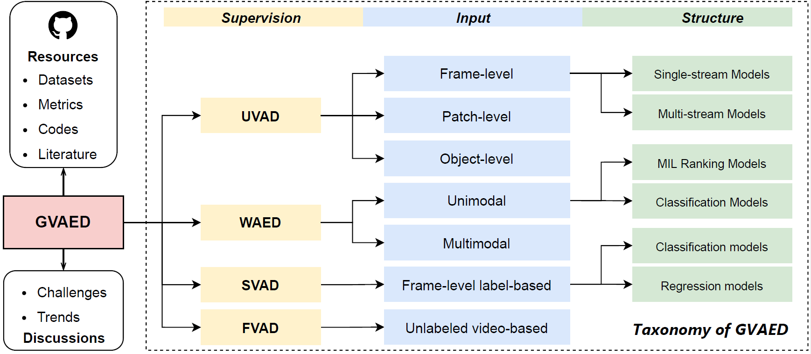

# Generalized Video Anomaly Event Detection: Systematic Taxonomy and Comparison of Deep Models

This is the official repository for our [paper](https://arxiv.org/abs/2302.05087) entitled *“Generalized Video Anomaly Event Detection: Systematic Taxonomy and Comparison of Deep Models”* accepted to [ACM Computing Surveys](https://dl.acm.org/journal/csur). We summarize existing deep learning-based video anomaly event detection (VAED) methods and classify these deep models  into four categories: unsupervised, weakly supervised, supervised, and fully unsupervised according to the supervised signal for training. In addition, we collate the public VAED datasets and available codes.

- Paper (ACM CSUR Published Version): https://dl.acm.org/doi/abs/10.1145/3645101

- Introduction in Chinese (中文版简介): https://mp.weixin.qq.com/s/s8zKuLYVV0k5Z_4fGT2-QQ

## Overview



## Datasets

| Dataset                                                                                                                                 | #Videos | #Normal | #Abnormal | #Scenes | #Anomalies |
| --------------------------------------------------------------------------------------------------------------------------------------- | ------- | ------- | --------- | ------- | ---------- |
| [UMN](http://mha.cs.umn.edu/proj_events.shtml#crowd)                                                                                    |         | 6,165   | 1,576     | 3       | 11         |
| [Subway Entrance](https://vision.eecs.yorku.ca/research/anomalous-behaviour-data/sets/)                                                 |         | 132,138 | 12,112    | 1       | 51         |
| [Subway Exit](https://vision.eecs.yorku.ca/research/anomalous-behaviour-data/sets/)                                                     |         | 60,410  | 4,491     | 1       | 14         |
| [Street Scene](https://www.merl.com/demos/video-anomaly-detection)$^{*}$                                                                | 81      | 159,341 | 43,916    | 205     | 17         |
| [CUHK Avenue](http://www.cse.cuhk.edu.hk/leojia/projects/detectabnormal/dataset.html)                                                   | 37      | 26,832  | 3,820     | 1       | 77         |
| [ShanghaiTech](https://svip-lab.github.io/dataset/campus_dataset.html)                                                                  | 437     | 300,308 | 17,090    | 13      | 158        |
| [UCSD Ped1](http://www.svcl.ucsd.edu/projects/anomaly/dataset.htm)                                                                      | 70      | 9,995   | 4,005     | 1       | 61         |
| [UCSD Ped2](http://www.svcl.ucsd.edu/projects/anomaly/dataset.htm)                                                                      | 29      | 2,924   | 1,636     | 1       | 21         |
| [UCF-Crime](https://webpages.charlotte.edu/cchen62/dataset.html)                                                                        | 1,900   |         |           |         | 950        |
| [ShanghaiTech Weakly](https://github.com/jx-zhong-for-academic-purpose/GCN-Anomaly-Detection/tree/master/ShanghaiTech_new_split)$^{**}$ | 437     |         |           |         |            |
| [XD-Violance](https://roc-ng.github.io/XD-Violence/)                                                                                    | 4,754   |         |           |         |            |
| [Ubnormal](https://github.com/lilygeorgescu/UBnormal)$^{***}$                                                                           | 543     | 147,887 | 89,015    | 29      | 660        |
| [ADOC](http://qil.uh.edu/main/datasets/)                                                                                                |         |         | 97,030    | 1       | 721        |

$^{*}$ *Following previous works, we set the frame rate to 15 fps.*

$^{***}$ *This dataset is reorganized from [ShanghaiTech](https://svip-lab.github.io/dataset/campus_dataset.html), so we provide the reorganized file list here.*

$^{***}$ *This datatset include a validation set that contains 64 videos.*

## Inference Speed

GVAED typically employs Average Inference Speed (AIS) as a metric for visually gauging the model's overhead cost. Comparisons across reported figures in the existing literature are often challenging due to variations in experimental environments and computational platforms. Recent advancements in GVAED research, such as object-level methods and weakly-supervised schemes, frequently involve intricate data preprocessing and the utilization of pre-trained models. Examples include foreground object detection, optical flow estimation, and spatial-temporal feature extraction using well-trained 3D convolutional networks. It remains unclear whether the computational cost and processing time associated with these aspects are factored into the overhead cost of the proposed model. Consequently, reporting inference speed is not a widespread practice, and the limited works providing such results often lack a comprehensive description of the experimental setup. Nevertheless, diligent efforts were made to aggregate AIS data from existing studies, aiming to offer an insightful overview of the trajectory in lightweight GVAED research. Acknowledging the influence of image resolution on model inference speed, we adhered to the approach outlined by [Ramachandra et al.](https://ieeexplore.ieee.org/abstract/document/9271895), summarizing the data while concurrently documenting the datasets used for model testing. The results are presented below:

| Year | Method                                                       | AIS (FPS) | Dataset                                   |
| ---- | ------------------------------------------------------------ | --------- | ----------------------------------------- |
| 2010 | [ADCS](https://ieeexplore.ieee.org/document/5539872)         | 0.4       | UCSD Ped2                                 |
| 2011 | [VParsing](https://ieeexplore.ieee.org/abstract/document/6126525?casa_token=A1Ad8yRdNZsAAAAA:TmOyqxnhhjQSKRwRld7wt-oBnBxwK7kXUNOEeREs0i6Vliqx_Njc7kfvgYip8TT6XkgYvkTM) | 0.13      | UCSD Ped1                                 |
| 2013 | [Avenue](https://ieeexplore.ieee.org/document/6751449)       | 150       | CUHK Avenue                               |
| 2013 | [SR](https://www.sciencedirect.com/science/article/pii/S0031320312005055) | 0.26      | UCSD Ped1                                 |
| 2014 | [ADL](https://ieeexplore.ieee.org/document/6531615)          | 1.25      | UCSD Ped2                                 |
| 2015 | [RTAD](https://ieeexplore.ieee.org/document/7301284)         | 200       | UCSD Ped 1 & Ped2, UMN                    |
| 2015 | [STVP](https://arxiv.org/abs/1502.06235)                     | 1         | UCSD Ped 1 & Ped2                         |
| 2015 | [HFR](https://ieeexplore.ieee.org/document/7298909)          | 2         | UCSD Ped1                                 |
| 2017 | [DAF](https://link.springer.com/chapter/10.1007/978-3-319-68548-9_70) | 20        | CUHK Avenue                               |
| 2017 | [Deep-cascade](https://ieeexplore.ieee.org/document/7858798) | 130       | UCSD Ped 1 & Ped2, UMN                    |
| 2017 | [ST-AE](https://link.springer.com/chapter/10.1007/978-3-319-59081-3_23) | 143       | CUHK Avenue, Subway, UCSD Ped  1 & Ped2   |
| 2017 | [stacked-RNN](https://ieeexplore.ieee.org/document/8237307)  | 50        | UCSD Ped2                                 |
| 2018 | [Deep-anomaly](https://www.sciencedirect.com/science/article/pii/S1077314218300249) | 370       | UCSD Ped2                                 |
| 2018 | [FFP](https://ieeexplore.ieee.org/document/8578782)          | 25        | CUHK Avenue                               |
| 2019 | [NNC](https://ieeexplore.ieee.org/document/8658419)          | 24        | CUHK Avenue, Subway, UMN                  |
| 2019 | [OC-AE](https://ieeexplore.ieee.org/document/8954309)        | 11        | CUHK Avenue, UCSD Ped2,  SHanghaitch, UMN |
| 2019 | [mem-AE](https://ieeexplore.ieee.org/document/9010977)       | 38        | UCSD Ped2                                 |
| 2019 | [AnoPCN](https://dl.acm.org/doi/abs/10.1145/3343031.3350899?casa_token=CtDCRI1_hoQAAAAA:LMQjm-oDrnwhJ-zw_UmEDnNt4z0HBxsSBDnh_viEJccFxcwcLXPbVFPh9zlbqIlnmwMFOT1FC4Y) | 10        | UCSD Ped2, CUHK Avenue,  ShanghaiTech     |
| 2020 | [Clustering](https://link.springer.com/chapter/10.1007/978-3-030-58555-6_20) | 32        | UCSD Ped2                                 |
| 2020 | [MNAD](https://openaccess.thecvf.com/content_CVPR_2020/html/Park_Learning_Memory-Guided_Normality_for_Anomaly_Detection_CVPR_2020_paper.html) | 67        | UCSD Ped2                                 |
| 2023 | [HN-MUM](https://link.springer.com/article/10.1007/s11042-023-15154-x) | 34        | UCSD Ped2                                 |
| 2023 | [CRC](https://dl.acm.org/doi/abs/10.1145/3581783.3612393)    | 46        | CUHK Avenue                               |


We recommend readers to reproduce the existing methods on their own particular platforms using the publicly available code that we have collected in Section 3, comparing the computational overheads of the various types of methods on a fair measurement benchmark.

## Tools

`anomalib`: An anomaly detection library comprising state-of-the-art algorithms and features such as experiment management, hyper-parameter optimization, and edge inference. [Project Page](https://github.com/openvinotoolkit/anomalib).

`PyAnomaly`: A PyTorch toolbox for video anomaly detection. [Paper](https://dl.acm.org/doi/10.1145/3394171.3414540), [Project Page](https://github.com/YuhaoCheng/PyAnomaly).

## Related Topics

- Domain Adaptation/Generalization

- Contrastive Learning

- Graph Learning

- Causal Inference

- Diffusion Model

- **Online Evolutive Learning**

## Citation

If you find our work useful, please cite our paper:

```latex
@article{liu2024generalized,
  title={Generalized video anomaly event detection: Systematic taxonomy and comparison of deep models},
  author={Liu, Yang and Yang, Dingkang and Wang, Yan and Liu, Jing and Liu, Jun and Boukerche, Azzedine and Sun, Peng and Song, Liang},
  journal={ACM Computing Surveys},
  year={2024},
  publisher={Association for Computing Machinery}
}
```
